# 배열(Array)

배열은 **인덱스와 원소값(<index, value>)의 쌍으로 구성된 집합**으로, 정의된 각 인덱스는 그 인덱스와 관련된 값을 가진다. 또한 배열의 **원소들은 모두 같은 자료형**을 가지기 때문에 메모리의 크기가 모두 같다. 각 원소의 물리적 위치와 논리적 위치(인덱스)의 순서는 일치하고 원소에 접근시 인덱스의 값을 이용하기 때문에 **직접 접근**(*direct access*)라고 한다. 인덱스란 추상화된 값(컴퓨터의 내부 구조나 메모리 주소와 무관하게 개념적으로 정의)이며 실제 메모리의 주소값은 16진수로 구성되어있는 실제 반도체의 물리적인 주소값이다. 따라서 운영체제는 접근하려는 원소의 인덱스를 이용하여 실제 메모리 주소를 계산한다.

#### 메모리의 주소값과 인덱스의 관계

인덱스는 사람이 이해하고 직관적으로 받아들이기 쉽게하기 위해 정의한 값이다. 그렇게 추상화된 값을 컴퓨터가 해석하여 물리적인 값으로 변환하고, 이를 전기 신호로 바꾸어 주소를 계산한다. **배열의 물리적인 저장 순서는 배열의 인덱스에 의해 결정**되며, 그 순서가 바로 메인 메모리에서 저장 위치의 순서가 된다. 실제로 사용되는 메모리의 각 영역에는 16진수로된 주소가 부여되어 있어서 프로그램을 작성하고 실행시키면 16진수 값의 주소를 찾아내서 데이터를 찾아오고 저장하게 되는 것이다.

### 배열 맛보기

배열은 인덱스와 값의 쌍으로 이루어져 있고 인덱스는 순서를 나타내는 원소의 유한 집합을 의미한다. 배열의 크기는 개발자가 정하기 때문에 배열의 인덱스 범위가 정해진다. 예를 들어 배열의 크기를 3으로 지정한다면 인덱스 i의 값은 [0], [1], [2]의 순서로 정해진다. 그리고 값을 나타내는 원소는 같은 자료형의 집합이기 때문에 int형으로 배열을 선언하게 되면 모든 원소의 크기는 int의 크기와 같다.

~~~c
int arr[]; //크기가 4인 정수형 배열
arr[0] = 1;
~~~

위의 코드에서 `arr`은 배열의 이름, `4`는 배열의 크기, `arr[0] = 1;`은 배열의 0번째에 있는 공간에 정수 1을 할당한 것이다. 나머지 1, 2 번째 인덱스에는 아직 값이 할당되지 않은 상태이고 만약 할당되지 않은 상태에서 참조를 하게 된다면 에러메세지를 반환하게 된다. 

## 배열의 연산 구현 예제

### 배열 생성 함수

~~~c
1 void create(int n) { // n = 5
2     int a[n];
3     int i;
4     for (i = 0; i < n; i++) {
5         a[i] = 0;
6     }
7 }
~~~

2행에서 다섯개의 원소를 저장할 수 있는 배열의 메모리 공간을 정의하고 4~6행 반복문에서 초기값으로 0을 할당해줌  

#### 배열 생성 결과

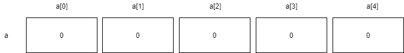

### 배열 검색, 저장 함수

#### 검색연산

~~~c
1 #define array_size = 5
2 int retrieve(int *a, int i) { // i = 2
3     if (i >= 0 && i < array_size){
4         return a[i];
5     } else {
6         printf("Error \n");
7         return (-1);
8     }
9 }
~~~

1 인덱스의 범위를 #define 함수로 정의

2 배열을 가리키는 변수 a와  반환할 원소의 값의 위치를 가리키는 i 변수의 값을 매개변수로 전달받음

3-4 i의 값이 인덱스 유효 집합 범위 내에 있는지 확인. 여기서는 참이므로 `a[2]`의 값인 30을 반환

6-7 i가 인덱스 유효 집합 범위에 해당하지 않으면 에러메세지 출력 후 범위가 잘못되었음을 알리는 -1을 반환하고 종료

#### 저장 연산

~~~c
1 #define array_size = 5
2 void store(int *a, int i, int e) { // i = 3, e = 35
3     if (i > 0 && i < array_size) {
4         a[i] = e;
5     } else {
6         printf("Error \n");
7     }
8 }
~~~

1 인덱스의 범위를 #define 함수로 정의

2 배열을 가리키는 변수 a와  원소 e를 저장할 원소값의 위치를 가리키는 i, 배열에 저장할 원소값 e를 매개변수로 전달받음

3-4 i의 값이 인덱스 유효 집함 범위 내에 있는지 확인, 여기서는 참이므로 `a[3]`에 35를 할당 후 종료

6 i가 인덱스 유효 집합 범위에 해당하지 않으면 에러메세지 출력 후 종료

#### 실행 결과

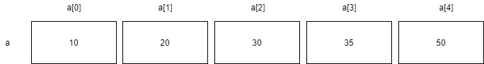

## 1차원 배열

배열의 가장 기본적인 형태. 한 줄짜리 배열이므로 인덱스는 하나이며, 메모리의 영역도 한 줄로 할당 받는다. 아래의 그림처럼 물리적 연속된 메모리와 추상적으로 연속된 배열과 일치되는 모습이다.

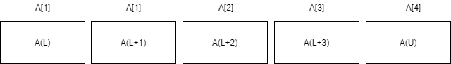

배열의 원소들은 컴퓨터 메모리의 연속적인 기억장소에 할당되어 순차적으로 저장된다. 따라서 배열의 첫 번째 원소 A[0]의 메모리 시작 주소를 a라고 하고 각 자료형의 크기 k를 알면 A[i]의 주소를 알 수 있다. A[i]는 A[0]부터 시작하여 i번째 원소이므로 원소의 크기를 k라고 가정하면 A[i]의 저장 주소는 a + i * k가 된다.

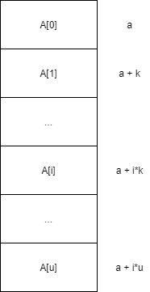

## 배열의 확장

1차원 배열을 여러개 쌓아 놓으면 **2차원 배열**이 되는데 
2차원 배열은 행렬을 프로그램을 구현하는 경우에 많이 사용되며, 아래와 같이 *행우선 배열*과, *열우선 배열*이 있다.  
#### 2차원 배열의 행우선 메모리 연속할당
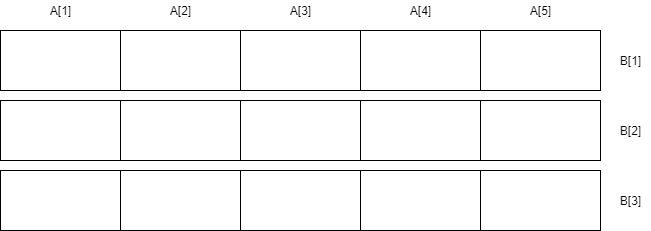

#### 2차원 배열의 열우선 메모리 연속할당
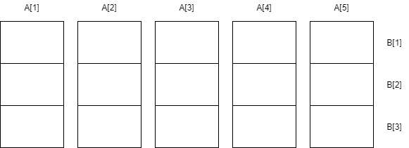

2차원 배열에서 하나의 원소는 두 개의 첨자(i, j)으로 구분되며, 두 개 이상의 첨자가 필요한 배열을 총칭하여 **다차원 배열**이라고 한다. 첨자 i에 해당하는 것을 행(*row*), j에 해당하는 것을 열(column)이라고 한다. 아래 그림과 같이 첨자 i와 j를 이용하여 위치가 결정된다.
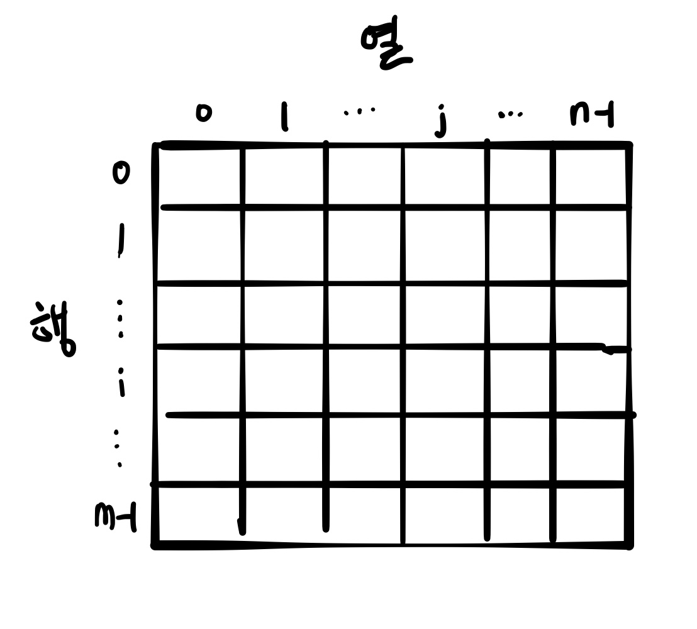

2차원 배열은 메모리를 어떻게 할당 받을까? 1차원 배열의 메모리 할당과 마찬가지로 1차원 선형으로 주소값이 결정된다. 하지만 다음의 그림처럼 1차원 배열과는 다르게 메모리를 할당 받는다.

#### 행우선 할당
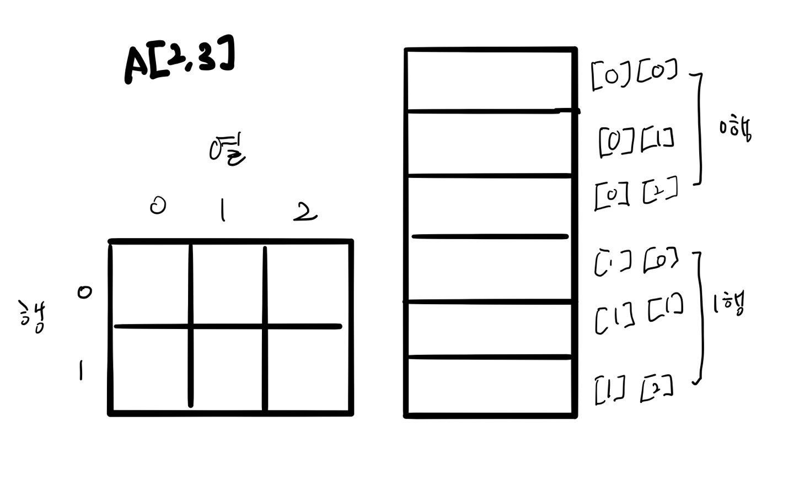

1차원 배열을 가로로 모아놓은 행우선 할당은 **가로의 1차원 배열 단위로 메모리 영역을 할당**한다. 즉, 하나의 행을 연속적으로 메모리에 할당하고, 그 다음 행을 메모리 영역에 할당하는 방법이다. A[m][n]의 방식으로 선언이 되는데 m은 행의 수, n은 열의 수를 나타낸다. 행우선 순서에 따라 할당할 경우 0행에 해당하는 열의 첨자 값들이 차례대로 증가되며 할당된다. 즉 n의 수가 0부터 증가하여 2까지 도달하게 되면 m의 값이 1 증가하고 n의 값이 다시 0부터 증가하는 방식이다.

#### 열우선 할당
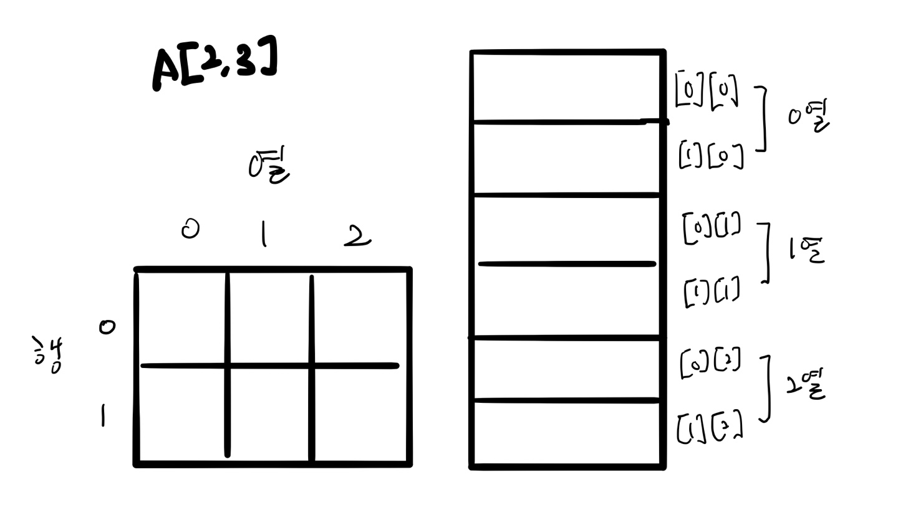

1차원 배열을 세로로 모아놓은 열우선 할당은 **세로의 1차원 배열 단위로 메모리 영역을 할당**한다. 즉, 하나의 열을 연속적으로 메모리에 할당하고, 그 다음 열을 메모리 영역에 할당하는 방법이다. A[m][n]의 방식으로 선언이 되는데 m은 행의 수, n은 열의 수를 나타낸다. 행우선 순서에 따라 할당할 경우 0열에 해당하는 행의 첨자 값들이 차례대로 증가되며 할당된다. 즉 m의 수가 0부터 증가하여 2까지 도달하게 되면 n의 값이 1 증가하고 m의 값이 다시 0부터 증가하는 방식이다.  
  
정리하자면 결국 **메모리에서 물리적인 저장 순서와 인덱스의 순서는 일치한다는 배열의 성질은 2차원 배열에서도 유효하다.**

## 희소행렬(*sparse matrix*)

2차원 배열은 논리적으로 바둑판 형태를 띠기 때문에 행렬을 표현하기에 적합하지만 아래와 같이 0인 원소가 그렇지 않은 원소보다 많은 희소행렬이라면 메모리 낭비가 발생한다.

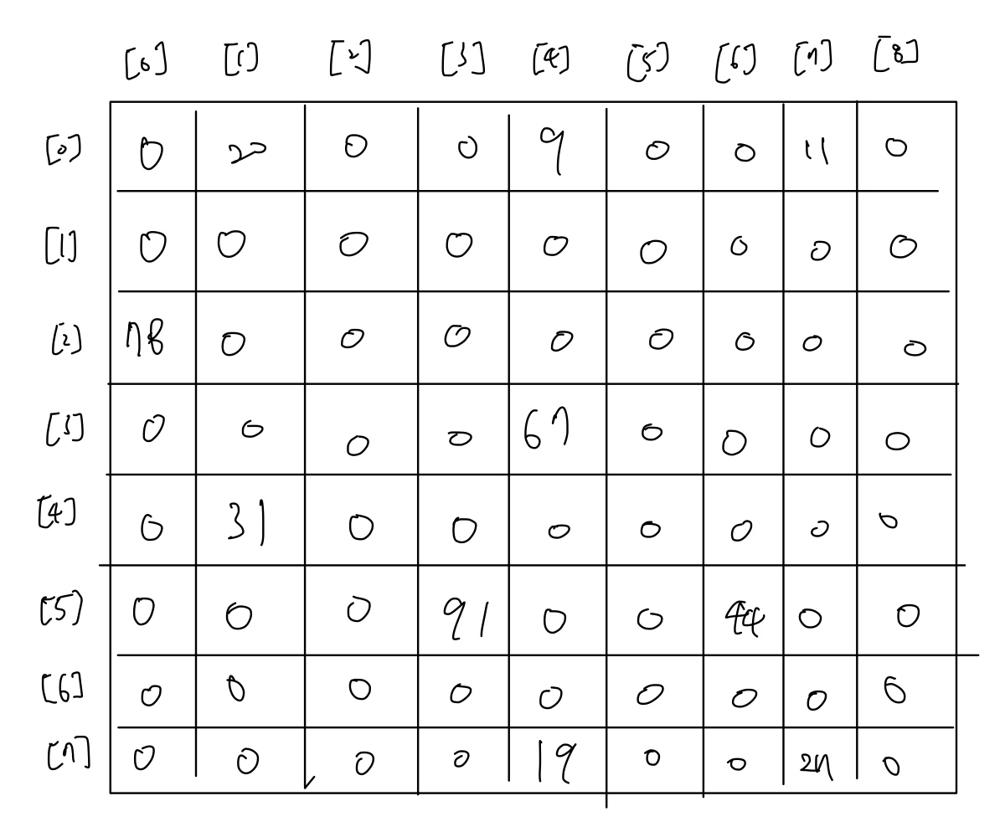

0의 값을 저장하기 위해서 불필요하게 많은 컴퓨터 메모리가 요구된다. 따라서 컴퓨터의 메모리 낭비를 막고 처리의 효율성을 높이기 위해서 희소행렬의 0인 원소는 저장하지 않고 0이 아닌 원소들은 (행번호, 열번호, 원소값)의 형태로 나타내면 아래외 같이 표현 가능하다.

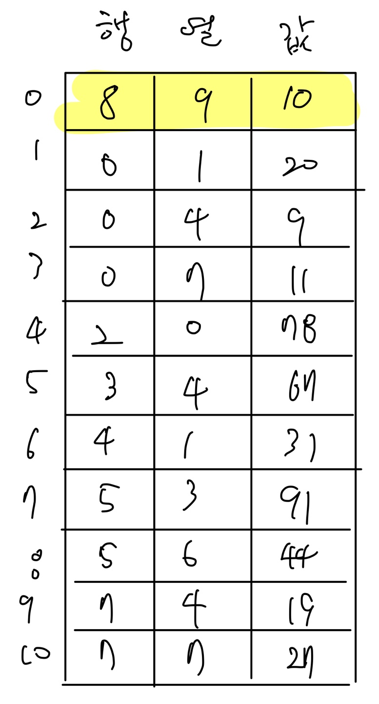

첫 번째 행은 행 번호와 열 번호를 나타내는 것으로 표현하려는 희소행렬의 행 크기와 열 크기를 나타낸다. 즉, [0, 0]의 값인 8은 행의 개수인 8을 의미한다. 그리고 [0, 1]의 값인 9는 열의 개수인 9를 의미한다. 그리고 [0, 2]의 값인 10은 0이 아닌 값인 원소의 개수를 의미한다. [1, 0]의 값인 0과 [1, 1]의 값인 1은 처음으로 0이 아닌 값인 20에 대한 좌표인 [0, 1]을 나타낸다.
