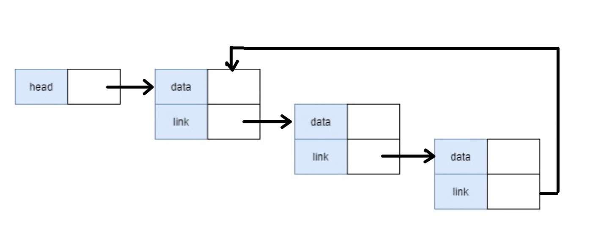

# 연결 리스트(Linked List)

리스트는 **일정한 순서가 있는 자료구조**이다. 배열은 논리적 순서와 물리적 순서가 일치해야 하지만 리스트는 **논리적인 순서만 유지주면 된다.** 리스트는 배열을 사용하여 구현하는 방법과 원소값을 저장하는 공간과 다음 원소를 가리키는 위치 정보를 저장하는 공간을 구현하는 방법, 이렇게 두가지가 있다.

## 배열을 이용한 리스트 구현

배열로 리스트를 구현하는 방법은 간단하다. 1차원 배열을 사용하여 저장하는 것이다. 배열을 이용하여 구현하는 것은 상대적으로 간단하며, 포인터를 위한 공간이 필요없기 때문에 메모리 공간 활용 효율도 높다. 하지만 **배열로 구현하였기 때문에 물리적 순서와 논리적 순서가 일치**한다. 그렇기 때문에 **원소의 삽입이나 삭제에 시간이 많이 소요**될 수 있다. 예를 들면 200개의 요소가 들어있는 리스트 2번째에 요소를 삽입하면 199개는 한칸씩 뒤로 밀려야하고, 삭제가 발생한다면 삭제된 요소 뒤의 요소들은 한 칸씩 다시 앞당겨져야 한다. 프로그램 실행 중에 시간이 소요가 많이 되기 때문에 자주 사용되는 방식은 아니다.

## 포인터를 이용한 리스트 구현

포인터를 이용한 방식은 원소의 자리에는 원소를 저장하고, 다음 원소를 가리키는 정보의 자리에는 다음 원소가 저장될 주소값을 저장한다. 이 쌍을 *노드*라고 표현을 하며, *노드*에는 데이터와, 다음 요소를 가리키는 포인터(링크)가 저장되어있다고 생각하면 된다.

위의 그림과 같이 주소값은 연속될 필요가 없고 드문드문 저장되어도 노드에 저장되어 있는 포인터를 이용하여 다음 노드를 찾아갈 수 있다. 포인터를 이용하여 구현되는 리스트를 **연결 리스트**라고 한다.

**연결 리스트는 노드간의 포인터 연결을 통해서 구현**되며, 각 노드는 적어도 두 종류의 필드, **원소값을 저장하는 데이터필드와 노드 연결을 위한 링크 필드를 가진다.** 위 그림에서 보이는 `head`요소는 연결 리스트의 시작 노드를 가리키며, 마지막 노드를 제외한 나머지 노드는 논리적으로 다음에 위치하는 노드를 가리키는 주소를 가지게 된다. 마지막 링크는 널 포인터(*null pointer*)로 표현한다.

## 연결 리스트에서 노드의 삽입과 삭제

### 노드의 삭제

A의 요소를 가지고 있는 노드의 포인터 변수가 가리키는 노드(B)를 삭제하기 위해서는 B를 가리키고 있는 선행 노드(A)의 연결을 끊고 B의 후행노드(C)로 연결시켜 주면 된다.

### 노드의 삽입

노드의 삽입은 삭제보다는 조금 복잡한데, 아래와 같이 A, B, C를 가지고 있는 노드들이 있다고 했을 때, 
  
 B와 C사이에 노드를 삽입하려면 아래의 그림과 같이 먼저 노드를 하나 생성한 뒤.  
  
다시 아래의 그림처럼 B와 C사이의 링크를 끊고 B는 D로 연결, D는 다시 C로 연결하여 삽입을 하면된다.
  
논리적 순서만 일치하면 되므로 위와 같이 물리적 순서가 맞지 않더라도 상관이 없다.

### C를 이용하여 간단한 연결 리스트 구현

~~~c
#include <stdio.h>
#include <stdlib.h>

struct Node* head = NULL;

//노드 구조체 선언
struct Node {
    int data;
    struct Node* link;
};

//새로운 노드 생성
struct Node* newNode(int data) {
    struct Node* node = (struct Node *) malloc(sizeof(struct Node));
    node->data = data;
    node->link = NULL;

    return node;
}

int nodeLen() {
    int i = 0;
    struct Node* curr = head;
    while(curr != NULL) {
        curr = curr->link;
        i++;
    }

    return i;
}

//노드 추가
void addNode(int value) {
    struct Node* node = newNode(value);

    struct Node* curr = head;

    while(curr->link != NULL) {
        curr = curr->link;
    }

    curr->link = node;
}

//노드 삭제
void deleteNode(int index) {
    if (index >= nodeLen(head)) {
        printf("존재하지 않는 노드입니다.");
        return;
    }

    // 첫 번째 노드 삭제
    if (index == 0) {
        struct Node* temp = head;
        struct Node* holder = head->link;

        head = holder;
        free(temp);
        return;
    }

    struct Node* curr = head;

    for (int i = 0; i < index - 1; i++) {
        curr = curr->link;
    }

    free(curr->link);
    curr->link = curr->link->link;
}

int getNode(int index) {
    if (index >= nodeLen(head)) {
        printf("존재하지 않는 노드입니다.");
        return -1;
    }

    struct Node* curr = head;

    for (int i = 0; i < index; i++) {
        curr = curr->link;
    }

    return curr->data;
}

int main() {
    head = newNode(100);
    addNode(1);
    addNode(2);
    addNode(3);

    deleteNode(0);
    deleteNode(1);

    printf("%d\n", getNode(0));
    printf("%d\n", getNode(1));
    printf("%d", nodeLen());
}
~~~

## 연결 리스트의 변형

연결 리스트는, **단순 연결 리스트**, **이중 연결 리스트**, **원형 연결 리스트**로 변형될 수 있다. 단순 연결 리스트는 링크가 하나만 있고, 각각의 노드는 후행 노드만을 가리키는 구조이다. 따라서 후행 노드 검색은 쉽지만 선행노드를 찾으려면 다시 헤드로 돌아가서 재탐색 해야한다. 이러한 단점을 해결하기 위해 이중 연결 리스트가 제안되었다. **이중 연결 리스트는 선행 노드를 기리키는 링크와, 후행 노드를 가리키는 링크를 가지며, 선행 노드를 찾으려면 그저 선행 노드를 가리키는 링크를 따라가기만 하면 된다.**

### 원형 연결 리스트

단순 연결 리스트의 가장 마지막 노드는 언제나 null이다. 마지막 원소 뒤에는 아무 것도 없기 때문이다. 이 마지막 노드를 활용하면서 프로그램의 성능에 도움이 되도록 하기 위해 원형 연결 리스트가 제안되었다. 원형 연결 리스트는 한 방향으로 모든 노드가 계속 연결되어 있기 때문에 한 노드로부터 어떤 노드로도 접근이 가능하다는 장점이 있다.

#### c를 이용한 원형 연결 리스트 구현
~~~c
typedef struct ListNode {
    int data;
    struct ListNode* link;
} listNode;

typedef struct {
    listNode* head;
} linkedList_h;

//head 노드 생성
linkedList_h* createLinkedList_h(void) {
    linkedList_h* H = (linkedList_h*)malloc(sizeof(linkedList_h));
    H->head = NULL;
    return H;
}

void addFirstNode(linkedList_h* H, int x) {
    listNode* tempNode;
    listNode* newNode = (listNode*)malloc(sizeof(listNode));
    newNode->data = x;
    newNode->link = NULL;

    if (H->head == NULL) { //리스트가 공백인 경우 새로운 노드를 head로 만들고 자신과 연결 시킴
        H->head = newNode;
        newNode->link = newNode;
        return;
    }

    tempNode = H->head;
    while(tempNode->link != H->head) { //head 전까지 루프를 돌림(마지막 노드 찾기)
        tempNode = tempNode->link;
    }
    newNode->link = tempNode->link; //새로운노드->첫번째 노드
    tempNode->link = newNode; //마지막 노드->새로운 노드
    H->head = newNode; //헤드->새로운 노드

    // 결과: head->새로운노드(삽입)->첫번째 노드->...->마지막노드->새로운 노드(삽입)
}

//중간 노드에 삽입
void addMiddleNode(linkedList_h* H, listNode* prevNode, int data) {
    listNode* newNode = (listNode*)malloc(sizeof(listNode));
    newNode->data = data;
    newNode->link = NULL;

    newNode->link = prevNode->link; //새로운노드->이전노드의 다음 노드
    prevNode->link = newNode; //이전 노드->새로운 노드

    //결과: ...->이전 노드->새로운 노드(삽입)->이전 노드의 다음 노드->...
}

//노드 삭제
void deleteNode(linkedList_h* H, listNode* prevNode) {
    listNode* delNode = prevNode->link; //삭제할 노드 세팅
    prevNode->link = delNode->link; //이전 노드->삭제할 노드의 다음 노드

    if (delNode == H->head) { //삭제할 노드가 첫 번째 노드 라면
        H->head = delNode->link; //head->삭제할 노드의 다음 노드
    }
    free(delNode); //삭제할 노드 메모리 해제
}
~~~

### 이중 연결 리스트

단순 연결 리스트는 단방향의 링크를 가지고 있다. 단방향 링크를 가지는 리스트(포인터를 이용한 리스트, 연결 리스트)는 배열을 이용한 리스트에 비해 유연한 자료구조이며, 메모리 할당과 활용에 비해서도 효과적이고 유리한 면이 많다. 하지만 단점이 존재하는데 바로 해당 노드의 선행 노드를 찾기가 매우 번거롭다는 것이다. i번째에 있는 노드의 선행 노드 즉, i-1번 째 노드를 찾으려면 처음부터 노드 하나 하나를 거쳐가며 찾아야 한다. 이러한 문제점을 해결하기 위해 이중 연결 리스트가 제안되었다. 이중 연결 리스트는 특정 노드의 선행 노드를 찾거나 리스트의 원소들을 역순으로 나열 하는 것이 가능하다.

#### c를 이용한 이중 연결 리스트 구현

~~~c
typedef struct ListNode {
    struct ListNode* Llink;
    int data;
    struct ListNode* Rlink;
} listNode;

typedef struct {
    listNode* Lhead;
    listNode* Rhead;
} linkedList_h;

//head 노드 생성
linkedList_h* createLinkedList_h(void) {
    linkedList_h* H = (linkedList_h*)malloc(sizeof(linkedList_h));
    H->Lhead = NULL;
    H->Rhead = NULL;
    return H;
}

//노드 삽입
void addNode(listNode* prevNode, int x) {
    listNode* newNode = (listNode*)malloc(sizeof(listNode));
    newNode->Llink = NULL;
    newNode->data = x;
    newNode->Rlink = NULL;

    newNode->Rlink = prevNode->Rlink; //새로운 노드의 Rlink에 이전 노드의 다음 노드 주소 값 저장
    prevNode->Rlink = newNode; //이전 노드의 Rlink에 새로운 노드의 주소 값 저장
    newNode->Llink = prevNode; //새로운 노드의 Llink에 이전 노드 주소 값 저장
    newNode->Rlink->Llink = newNode; //새로운 노드의 다음 노드의 Llink에 새로운 노드 주소 값 저장
}

//노드 삭제
void deleteNode(listNode* delNode) {
    delNode->Llink->Rlink = delNode->Rlink; //삭제할 노드의 이전 노드의 Rlink에 삭제할 노드의 다음 노드 주소 값 저장
    delNode->Rlink->Llink = delNode->Llink; //삭제할 노드의 다음 노드의 Llink에 삭제할 노드의 이전 노드 주소 값 저장
    free(delNode); //삭제할 노드 자원 해제
}
~~~