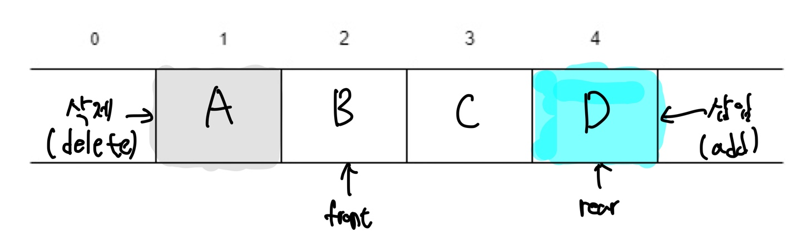
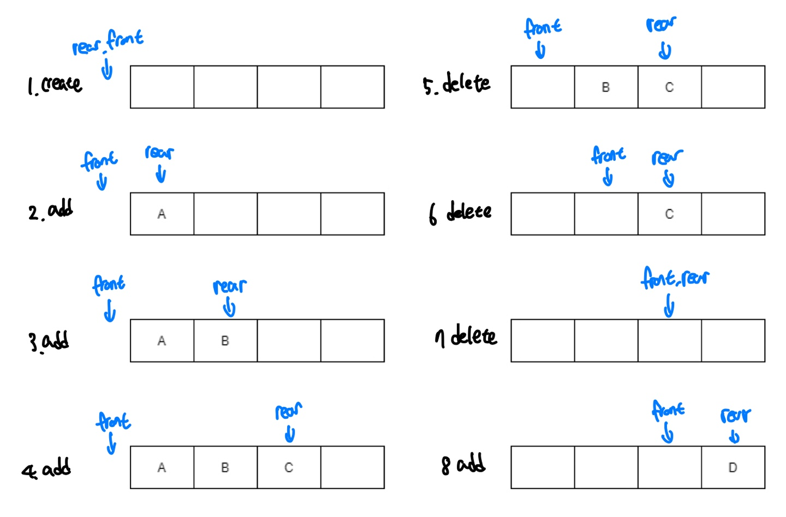
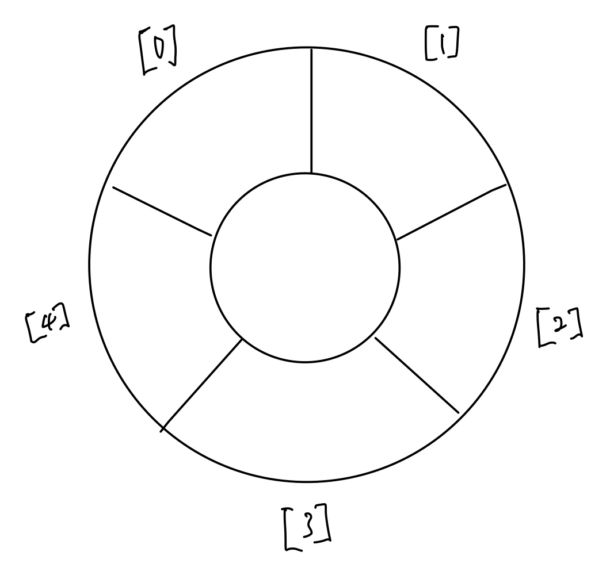
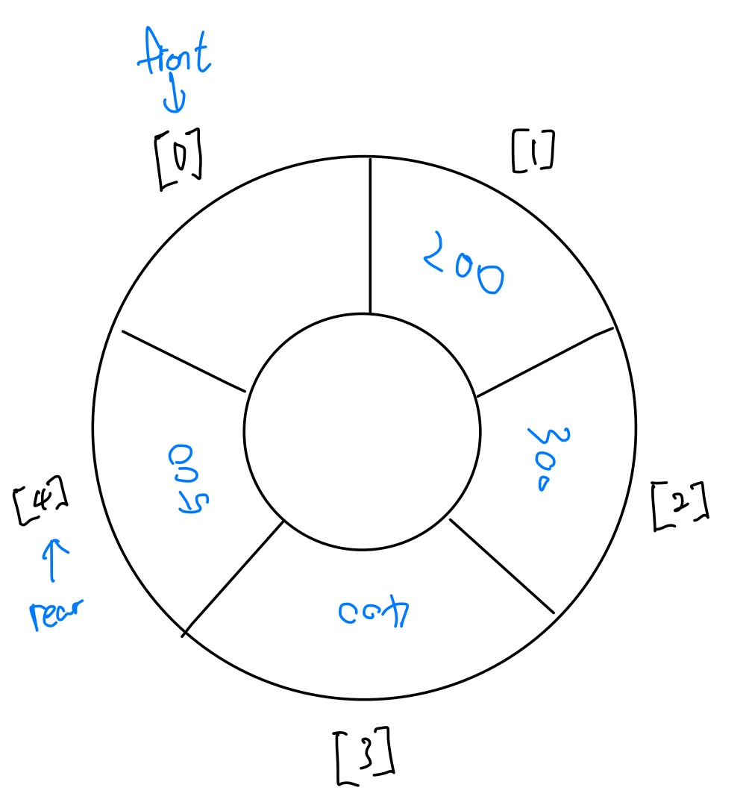
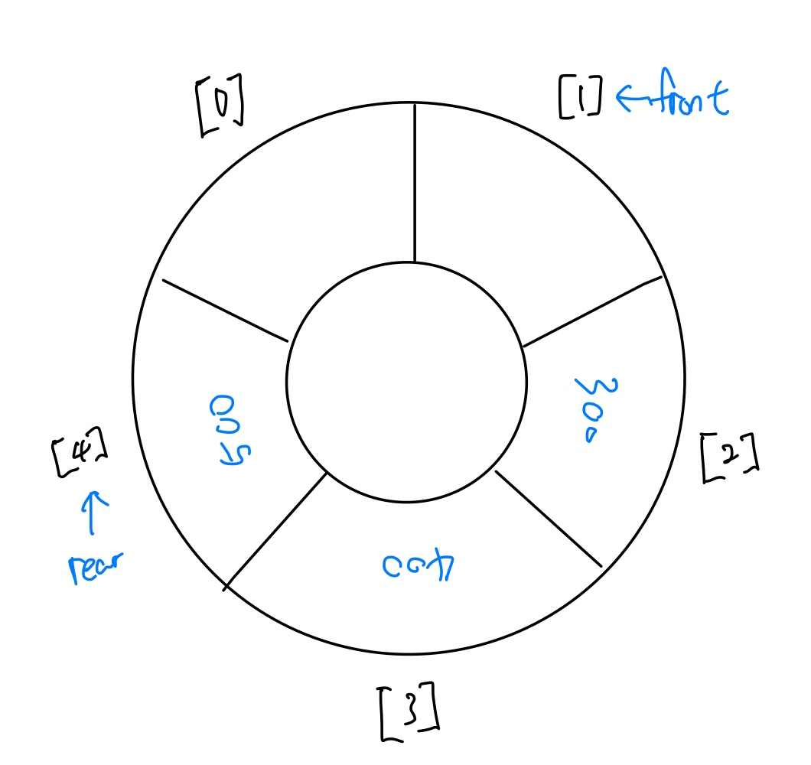
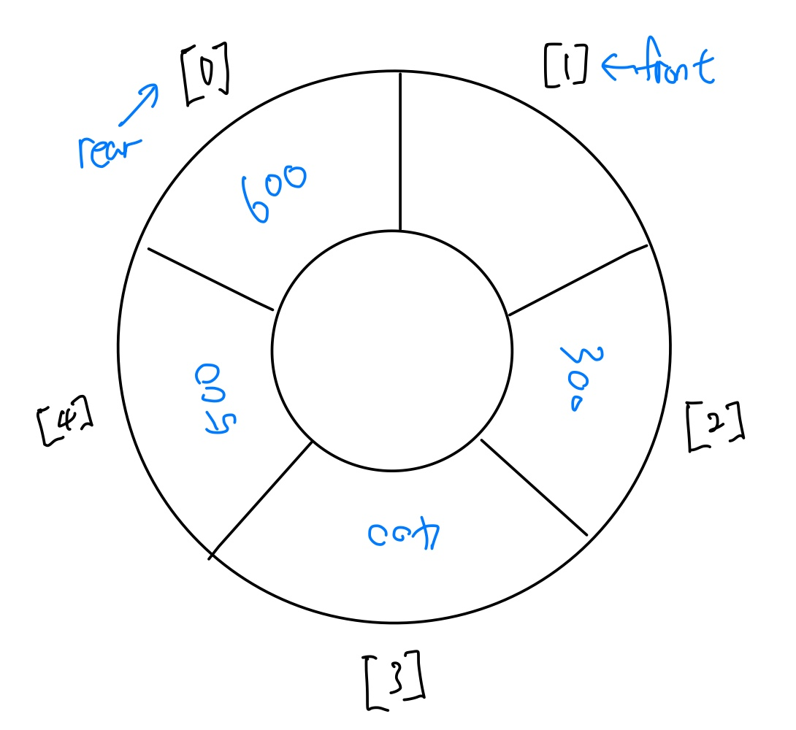

# 큐(Queue)

큐는 입력 순서와 출력 순서가 같은 **FIFO**(*First In First* Out) 구조이며, 스택과 달리 **삽입과 삭제가 발생하는 지점이 다르다.** 실생활에서의 줄서기나, 예약 시스템 등이 이에 해당한다.

스택이 한쪽 끝에서만 삽입과 삭제를 동시에 할 수 있는 것과 달리 큐는 한쪽 끝에서는 삽입만 가능하고 다른 한쪽 끝에서는 삭제 연산만 가능하다. 삭제가 일어나는 곳을 *front*라 하고 삽입이 일어나는 곳을 *rear*이라고 한다.

## 큐의 동작 방식

1. 크기가 4인 큐 생성
2. `A`삽입, *rear*가 `A`를 가리킴
3. `B`삽입, *rear*가 `B`를 가리킴
4. `C`삽입, *rear*가 `C`를 가리킴
5. 삭제 연산 수행, *front* 다음 위치에 있는 `A`가 삭제 됨
6. 삭제 연산 수행, *front* 다음 위치에 있는 `B`가 삭제 됨
7. 삭제 연산 수행, *front* 다음 위치에 있는 `C`가 삭제 됨, 큐가 비게 되고, *front*와 *rear*는 같은 위치
8. `D`삽입, rear가 한 칸 옆으로 이동하며 `D`가 그 자리에 삽입됨, *front*는 그대로 있음

## 원형 큐

### 배열로 구현한 큐의 문제점

요소가 들어가고 삭제가 되었을 때 인덱스가 앞에 있는 요소부터 삭제가 되는데, 삭제가 되고 난 후에 요소의 수는 줄어들지만 남아 있는 데이터를 앞으로 당겨오지 않기 때문에 큐가 가득차지 않더라도 *rear*의 값이 `size - 1`과 같아질 수 있는 문제가 발생한다. 이 문제를 해결하기 위해 원형큐가 제안되었다.

#### 원형 큐의 초기 상태

원형큐는 파이프의 입구와 출구 부분을 연결시킨 형태이다.

#### 원형 큐의 상태 1

#### 원형 큐의 상태 2

#### 원형 큐의 삽입 연산 결과

배열의 인덱스가 n-1이어도 다시 `rear`이 0으로 가서 삽입이 된다. 값은 mod를 이용하여 만들어 주면된다.

## C를 이용하여 원형 큐 구현

~~~c
#include <stdio.h>
#include <limits.h>
#include <stdlib.h>

//큐 구조체 선언
struct Queue {
    int front;
    int rear;
    int size;
    int* items;
};

//생성
struct Queue* createQueue(int size) {
    struct Queue* queue = malloc(sizeof(struct Queue));
    queue->size = size;
    queue->front = -1;
    queue->rear = -1;
    queue->items = malloc(sizeof(int) * size);

    return queue;
}

//가득 차있는지 확인
int isFull(struct Queue* queue) {
    return queue->rear == queue->size - 1;
}

//비었는지 확인
int isEmpty(struct Queue* queue) {
    return queue->front == queue->rear;
}

//요소 삽입
void enqueue(struct Queue* queue, int item) {
    if (isFull(queue))
        return;

    queue->rear = (queue->rear + 1) % queue->size; //나머지 값으로 rear값을 결정
    queue->items[queue->rear] = item;
    queue->size += 1;
}

//요소 삭제
int dequeue(struct Queue* queue) {
    if (isEmpty(queue))
        return INT_MIN;

    queue->front = (queue->front + 1) % queue->size;  //나머지 값으로 front값을 결정
    queue->size -= 1;

    int result = queue->items[queue->front];
    queue->items[queue->front] = INT_MIN;

    return result;
}

int main() {
    struct Queue* queue = createQueue(1000);

    enqueue(queue, 10);
    enqueue(queue, 20);
    enqueue(queue, 30);
    enqueue(queue, 40);

    printf("%d 요소 삭제\n", dequeue(queue));
    printf("%d 요소 삭제\n", dequeue(queue));
    printf("%d 요소 삭제\n", dequeue(queue));
}
~~~