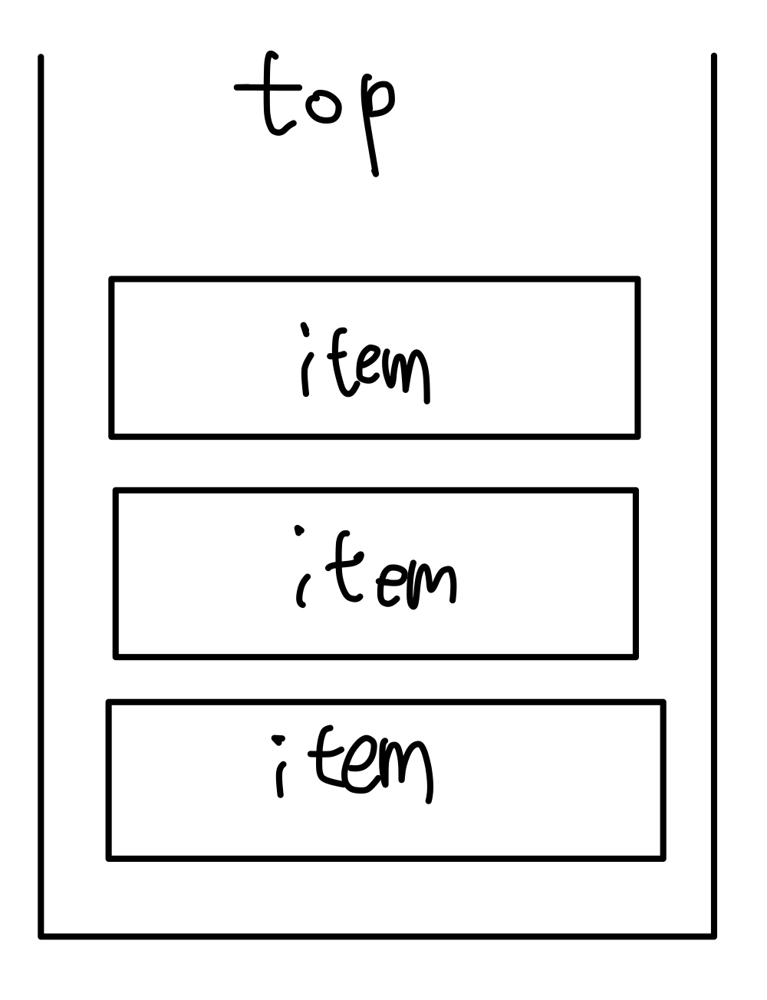
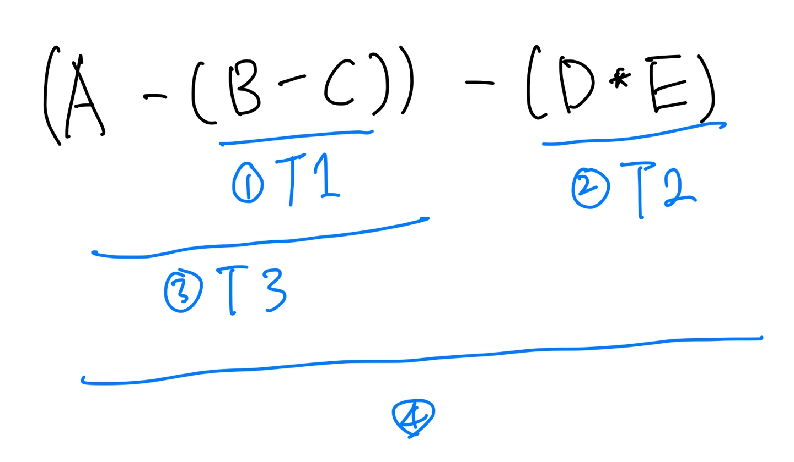
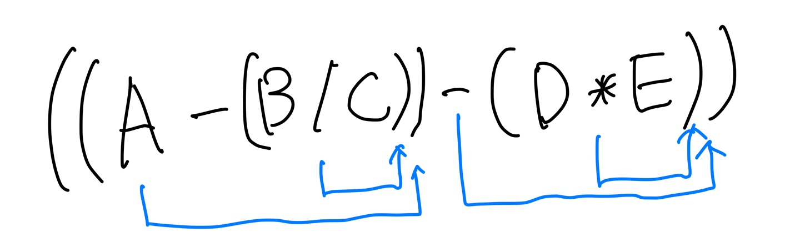
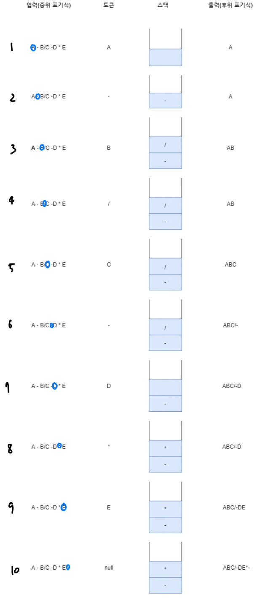

# 스택(Stack)

스택은 객체와 그 **객체가 저장되는 순서를 기억하는 자료구조**이다. 예를 들어 상자가 하나 있다고 했을 때 상자의 입구 부분을 스택의 *top*이라고 정의하고 *top*에서만 물건을 넣고 꺼낼 수 있다. 마지막에 들어간 데이터가 가장 처음에 나오므로 **LIFO**(Last In First Out) 구조라고 불린다.

실제로 프로그래밍 언어로 구현하는 경우에는 **top이라는 스택 포인터 변수를 사용하고, 스택의 삽입과 삭제가 일어나는 지점을 가리키며, 자료 삽입 시에는 스택 포인터인 top를 증가시키고 자료 삭제 시에는 top를 감소**시켜야 한다. 스택에서 사용되는 함수는 대표적으로 *push*(add)와 *pop*(delete)가 있는데, *push*는 스택에 원소 하나를 삽입하는 함수이며, *pop*은 스택에서 원소 하나를 제거하는 함수이다. *push*는 *top* 포인터를 증가시키고 *pop*은 *top* 포인터를 감소시킨다. 스택의 크기는 유한하며, 그렇기 때문에 스택에 원소를 넣었을 때 스택이 꽉 차있는지 검사해야한다. 반면에 스택의 크기 제한과는 무관하게 원소를 제거할 때는 스택에 제거할 원소가 남아있는지 검사하고 삭제해야한다.

## 스택의 동작 방식

1. `create`를 하여 원소를 세개까지 저장할 수 있는 스택이 생성
2. `S`를 삽입하여 *top*이 `S`를 가리킴
3. `T`를 삽입하여 *top*이 `T`를 가리킴
4. pop()을 호출하여 최상단의 데이터가 제거되고 *top*이 감소됨
5. `R`을 삽입하여 *top*이 `R`을 가리킴
6. `P`을 삽입하여 *top*이 `R`을 가리킴, 스택이 가득참
7. `Q`를 삽입하지만 스택이 가득 차있기 때문에 'stackFull'이 출력되고 스택에는 변화가 없음
8. `pop()`을 호출하여 최상단의 데이터가 제거되고 *top*이 감소됨

## 스택의 응용

스택은 컴퓨터 시스템 측면에서 아주 많은 분야에서 사용되기 때문에 응용 분야가 다양하다. 먼저 변수에 대한 메모리 할당과 수집을 위한 **시스템 스택**(*System Stack*)이 있다. 시스템 스택은 프로그램에서 사용되는 변수의 생명주기를 관리해준다. 변수의 생명주기란 프로그램이 실행되기 위해 할당되는 메모리 공간에서 변수가 메모리 영역 할당받고 할당받은 메모리를 비울 때까지의 시간을 말한다. 두 번째는 서브루틴의 수행이 끝난 후에 되돌아갈 함수의 주소를 저장하기 위한 **서브루틴 호출**(*subroutine call*) 관리를 위해 사용된다. 세 번째는 연산자들 간의 우선순위에 의해 계산 순서가 결정되는 **수식 계산**(*evaluation of expression*)이 있다. 사람은 전체 수식을 보고 어떤 부분이나 연산자부터 계산할지 결정할 수 있지만, 컴퓨터는 입력되는 단 하나의 문자와 그 이전에 입력된 문자에 대해서만 알고 있기 때문에 문자들을 스택에 저장하고 입력되는 문자들과의 관계를 이용하여 계산순위를 결정한다. 즉, 스택을 이용하여 연산자의 우선순위를 결정한다. 네 번째는 운영체제 내에서 프로그램의 수행 도중 발생되는 **인터럽트의 처리와 인터럽트 처리가 끝난 후에 되돌아갈 명령 수행 지점을 저장**하기 위해 사용된다. 또한 **컴파일러**, 함수 순환 호출이 끝난 후 되돌아갈 실행 주소를 저장하기 위한 **순환 호출 관리**등에 사용된다.

## C를 사용하여 구현
~~~c
#include <stdio.h>
#include <stdlib.h>

// 스택 구조체 선언
struct stack {
    int maxSize; //스택의 크기
    int top;
    int *items;
};

// 스택 생성
struct stack* newStack(int capacity) {
    struct stack *pt = malloc(sizeof(struct stack));

    pt->maxSize = capacity;
    pt->top = -1;
    pt->items = malloc(sizeof(int) * capacity);

    return pt;
}

// 스택의 길이 반환
int size(struct stack *pt) {
    return pt->top + 1;
}

// 스택이 비었는지 확인
int isEmpty(struct stack *pt) {
    return size(pt) == 0;
}

// 스택이 가득 차있는지 확인
int isFull(struct stack *pt) {
    return size(pt) == pt->maxSize - 1;
}

// 스택에 데이터를 넣음
void push(struct stack *pt, int item) {
    if (isFull(pt)) {
        printf("스택이 가득 찼습니다.");
        return;
    }

    pt->items[++pt->top] = item;
}

// 스택의 top에 있는데이터를 가져옴 (데이터 삭제 X)
int peek(struct stack *pt) {
    if (isEmpty(pt)) {
        printf("저장된 값이 없습니다.");
    }

    return pt->items[pt->top];
}

// 스택의 top에 있는 데이터를 꺼냄 (데이터 삭제 O)
int pop(struct stack *pt) {
    if (isEmpty(pt)) {
        printf("저장된 값이 없습니다.");
        return -1;
    }

    return pt->items[pt->top--];
}

int main() {
    struct stack *pt = newStack(5); //크기가 5인 스택 생성

    push(pt, 1); //요소 삽입
    push(pt, 2);
    push(pt, 3);

    printf("%d\n", pop(pt)); //요소 꺼내기
    printf("%d\n", pop(pt));
    printf("%d\n", pop(pt));
    printf("%d\n", pop(pt));
}
~~~

## 사칙연산식의 전위/후위/중위 표현

연산자의 우선순위는 기본 산술 연산자(`+`, `-`, `*`, `/`)가 제일 낮고, 비교 연산자(`<`, `≤`, `>`, `≥`, `=`, `≠`)보다 논리 연산자(`and`, `or`, `not` 등)이 더 높다. 수식의 표기 방법은 연산자와 피연산자의 위치에 따라 다음과 같이 세가지가 있다.
* 중위 표기법(infix notation): 연산자를 피연산자의 사이에 표기하는 방법이며, 일반적으로 가장 많이 사용됨 ex) A + B
* 전위 표기법(prefix notation): 연산자를 피연산자의 앞에 표기 ex) +AB
* 후위 표기법(suffix notation): 연산자를 피연산자의 뒤에 표기 ex) AB+

### 전위 표기법의 연산 순서

식: A - (B + K)/D  
우선 순위 대로 괄호를 넣으면 (A - ((B + K) / D))가 된다.
1. B + K => **+BK**
2. (+BK의 연산 결과)/D => **/(+BK의 연산결과)D**
3. (A - (/(+BK의 연산 결과)D)) => **-A(/(+BK의 연산 결과)D)의 연산 결과**

### 후위 표기법의 연산 순서
식: E + (A - B) * C/D
1. A - B => **AB-**
2. (AB-)C => **(AB-)C∗**
3. ((AB-)C*)/D => **((AB-)C∗)D/**
4. E + (((AB-)C*)D/) => **E(((AB-)C∗)D/)+**

## 스택을 이용한 후위 표기식 계산

### 변환 방법

1. 중위 표현식 연산자의 우선순위를 고려하여 (피연산자, 연산자, 피연산자)의 형태로 괄호로 묶는다.
2. 각 뭉치를 묶고 있는 괄호 안에서 연산자를 계산 뭉치의 가장 오른쪽으로 이동시킨다. 그리고 계산된 뭉치를 하나의 피연산자로 간주하여 1과 2를 반복한다.
3. 괄호를 모두 제거한다.

### 에제

식: A - B/C + D * E

괄호로 묶인 계산 뭉치에서 연산자를 괄호 안의 가장 오른쪽으로 이동

결과: ((A)BC/)-)(DE∗)-) -> **ABC/-DE∗-**

#### 스택을 이용한 후위 표기식 변환

1. `A`는 피연산자이므로 스택에 저장되지 않고 바로 출력
2. `-`는 연산자이므로 스택에 저장
3. `B`는 피연산자이므로 스택에 저장되지 않고 바로 출력
4. `/`는 연산자이므로 스택에 저장
5. `C`는 피연산자이므로 스택에 저장되지 않고 바로 출력
6. `-`는 연산자이므로 스택에 저장, 하지만 스택의 가장 위인 `/`가 `-`보다 우선순위가 높기 때문에 `/`를 삭제후 출력, 그 후 `-` 저장
7. `D`는 피연산자이므로 스택에 저장되지 않고 바로 출력
8. `*`는 연산자이므로 스택에 저장
9. `E`는 피연산자이므로 스택에 저장되지 않고 바로 출력
10. 더 이상의 입력값이 없으므로 스택에 저장된 연산자들을 순서대로 출력