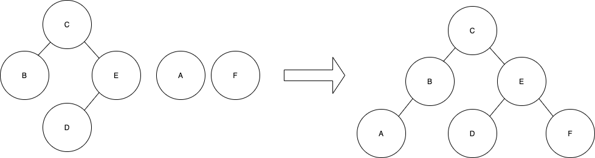
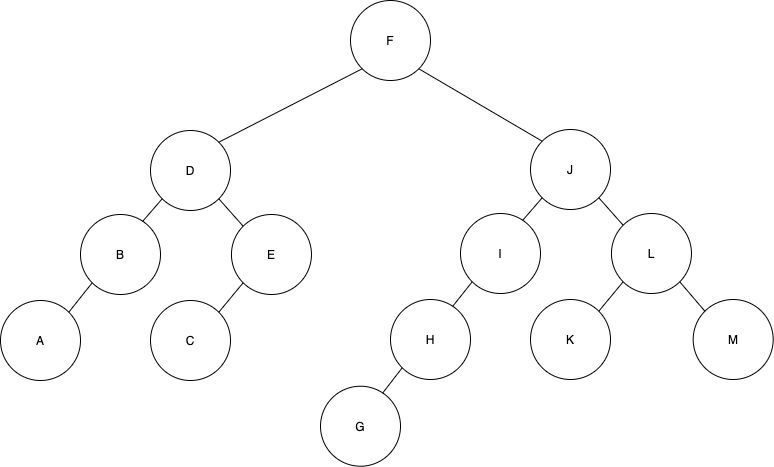

# 이진 탐색 트리(Binary Search Tree)

BS 트리는 트리에 특정 데이터가 있는지 검색하고, 노드를 자주 삽입, 삭제하는 응용 문제에 가장 효과적인 이진 트리이다. BS 트리는 이름에서 알 수 있듯이 **탐색에 최적화된 트리**이며 탐색을 위한 키(*key*)가 존재한다. 트리에 저장되는 데이터의 타입은 매우 다양한데, 그 데이터를 식별하기 위한 것이 바로 이 키이다.

## BS 트리의 정의

노드 vi의 키를 ki라 할 때 각 노드 vi가 다음을 만족하는 이진 트리를 BS 트리라고 한다.
> 1. vi의 왼쪽 서브 트리에 있는 모든 노드들의 키값은 vi의 키값보다 작다.
> 2. vi의 오른쪽 서브 트리에 있느 모든 노드의 키값은 vi의 키값보다 크다.

## BS 트리 순회

BS 트리는 전위 순회, 중위 순회, 후위 순회로 모든 정점을 차례대로 순회 가능하며 트리 내의 특정 정점을 탐색할 수도 있다.

#### C를 이용한 중위 순회 함수
~~~c
struct Node {
  struct Node *left;
  char key[10];
  int data;
  struct Node *right
}

void inOrder(struct Node *rootPtr) {
  if (rootPtr != NULL) {
    inOrder(rootPtr->left); //왼쪽 서브 트리 순회
    printf("%d", rootPtr->data); //데이터 출력
    inOrder(rootPtr->right); //오른쪽 서브 트리 순회
  }
}
~~~

## BS 트리 탐색

BS 트리는 탐색에 최적화된 트리이기 때문에 어떤 키값을 갖는 노드가 트리에 존재하는지 빠르게 확인할 수 있다. 노드 vi의 키를 ki이라 할 때, BS 트리에서 키 값이 k인 노드를 찾는 과정은 다음과 같다.

1. 트리가 비어있다면 탐색 실패, 아니면 k와 현재 루트 노드의 키값 ki을 비교한다.
2. k = ki이면 탐색 성공. 이 때 찾은 정점은 vi이다.
3. k < ki이면 vi의 왼쪽 서브트리를 탐색한다. 즉, vi = vi,left로 바꾸고 1로 돌아간다.
4. k > ki이면 vi의 오른쪽 서브트리를 탐색한다. 즉, vi = vi, right로 바꾸고 1로 돌아간다.

BS 트리의 탐색 함수는 트리의 루트 노드에 대한 포인터 값과 키 값을 매개변수로 받아 탐색에 성공하면 해당 노드의 포인터를 반환하고 실패하면 null을 반환한다. BS 트리는 현재 노드의 키값을 기준으로 왼쪽에는 작은 값, 오른쪽에는 큰 값이 저장되기 때문에 탐색 위치를 쉽게 판단할 수 있다. 또한 **한 번의 비교로 전체 데이터의 절반을 탐색 대상에서 제외하므로 매우 빠르게 탐색이 가능하다.**

#### C를 이용한 탐색 함수
~~~c
//키값 k와 루트 노드의 포인터를 매개변수로 받는다.
struct Node* search(char k[], struct Node *r) {
  //마지막까지 못찾으면 null 반환
  if (r == NULL) return NULL;
  //전달 받은 키와 현재 루트의 키를 비교하여 같으면 루트의 포인터 반환
  if (strcmp(k, r->key) == 0) {
    return r;
  //키가 현재 루트의 값보다 작다면 왼쪽 서브 트리 탐색
  } else if (strcmp(k, r->key) < 0) {
    return search(k, r->left);
  } else {
    //키가 현재 루의 값보다 크다면 오른쪽 서브 트리 탐색
    return search(k, r->right);
  }
}
~~~

## BS 트리 삽입

새로운 노드는 루트부터 키값을 비교하며 삽입될 위치가 왼쪽인지 오른쪽인지를 정하며 내려간다. 그러다 null에 도달하게 되면 그 공간에 새 노드를 할당한다. 만약 키 값이 같은 노드가 있다면 즉시 삽입 과정을 종료하게 된다(중복 데이터 제거). 삽입 알고리즘은 탐색 알고리즘과 거의 유사하다.

1. 트리가 비어있다면 키 k를 가지는 노드를 삽입한다. 그렇지 않으면 k와 현재 루트 노드의 키 ki을 비교한다.
2. k = ki이면 삽입을 중단한다.
3. k < ki이면 왼쪽 서브트리에 삽입해아 하므로 vi = vi->left로 바꾸고 1로 돌아간다.
4. k > ki이면 오른쪽 서브트리에 삽입해아 하므로 vi = vi->right로 바꾸고 1로 돌아간다.

#### C를 이용한 삽입 함수

~~~c
//새로운 노드와 루트 노드를 매개변수로 받는다.
struct void insert(struct Node *newPtr, struct Node *r) {
  //비어있다면 새로운 노드 삽입
  if (r == NULL) {
    r = newPtr;
  } else {
    //같은 값이 있으면 함수 종료
    if (strcmp(newPtr->key, r->key) == 0) return;
    //현재 값이 새로운 노드보다 작다면 왼쪽 서브트리로 간다.
    if (strcmp(newPtr->key, r->key) < 0) {
      r->left = insert(newPtr, r->left);
    } else {
      //현재 값이 새로운 노드보다 크다면 오른쪽 서브트리로 간다.
      r->right = insert(newPtr, r->right);
    }
  }
}
~~~

## BS 트리 삭제

삭제는 조금 복잡한데 위의 그림에서 H를 삭제한다고 했을 때, 서브 트리인 G는 삭제 후 I의 왼쪽 서브 트리가 되게 하면 되고, L는 K와 M 두 개의 서브 트리를 가지기 때문에 K와 M 중 하나를 L의 자리에 옮기면 된다. F의 경우엔 조금 복잡해 진다. D와 J 중 하나를 F의 자리로 옮겨야 하는데 D를 옮기게 되면 B나 E를 D의 자리로 옮겨야 한다. 또한 B를 D의 자리로 옮기게 되면 A나 C를 옮겨야 한다. 간단히 정리하자면, 순환적으로 특정 방향의 서브 트리의 위치를 계속 위로 올려주어야 한다는 것이다. 이렇게 하면 삭제 알고리즘은 BS 트리의 어떤 정점이라도 삭제가 가능하다. 이 방법 외에 다른 삭제 방법이 힌 가지 더 있는데 삭제한 노드를 그냥 삭제했다는 표시를 해두고 내버려 두는 방법이다. 삭제된 노드를 순회 경로로민 사용하고 노드로는 무시를 하는 것이다. 전자보다 메모리 공간은 더 들겠지만 편리하다는 장점이 있다.