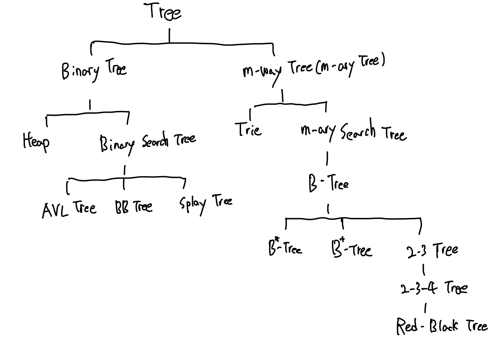
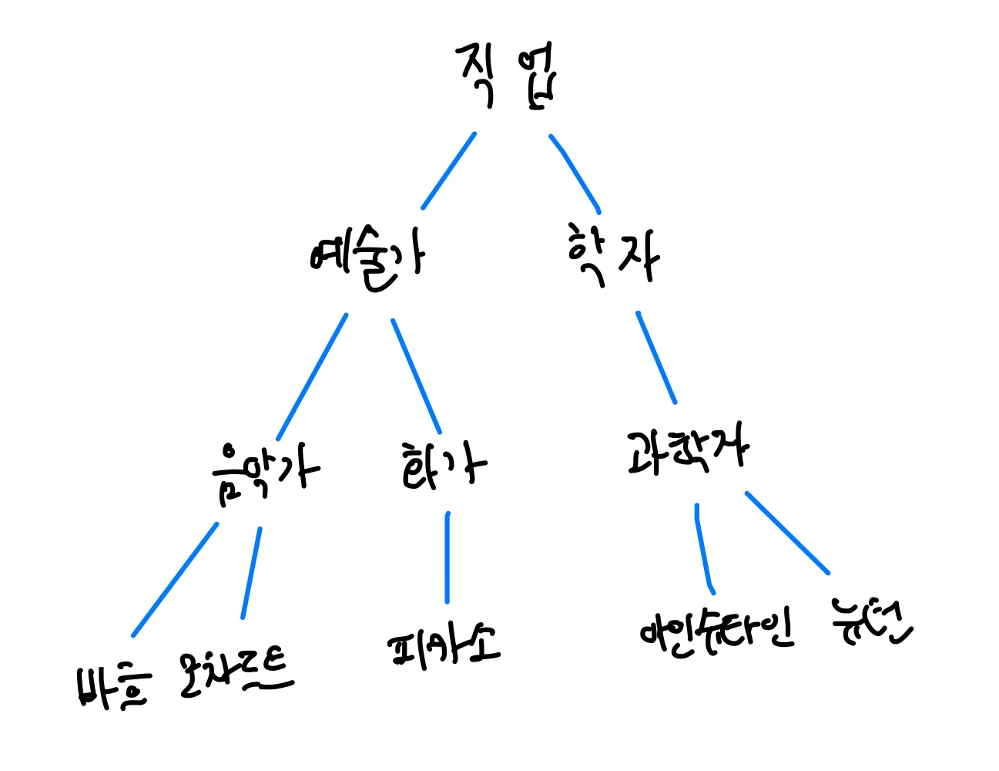
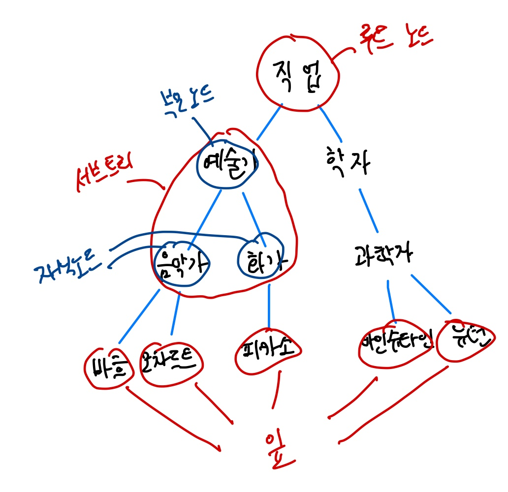
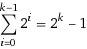
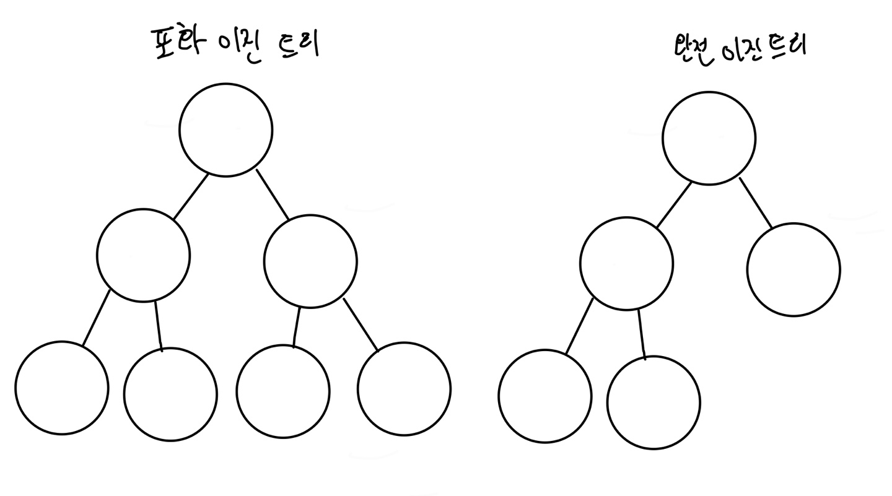
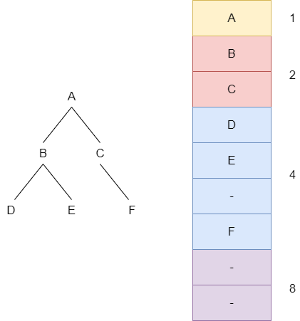
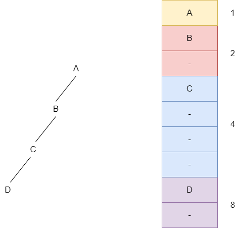
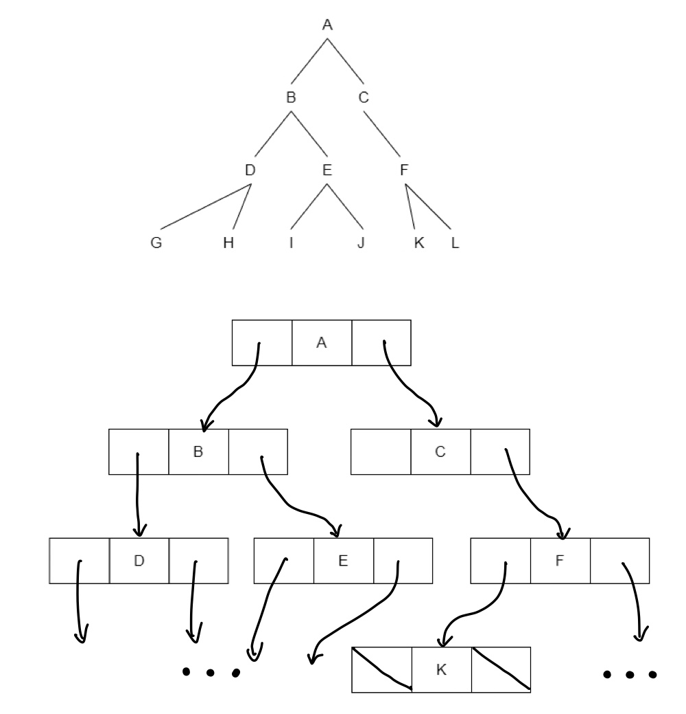
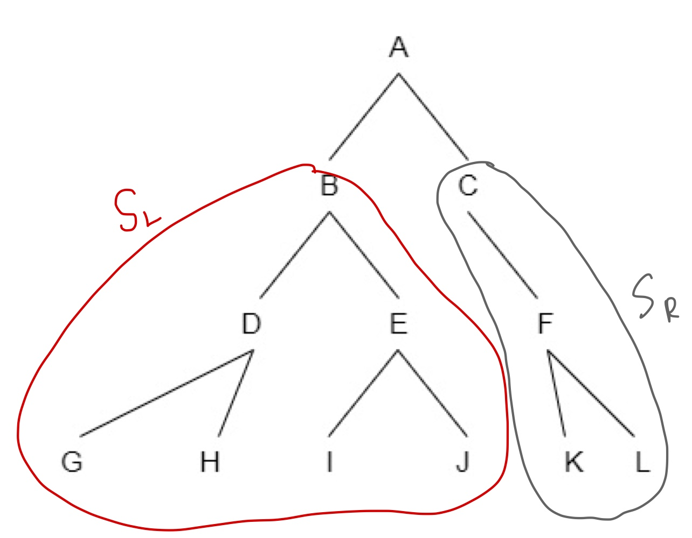
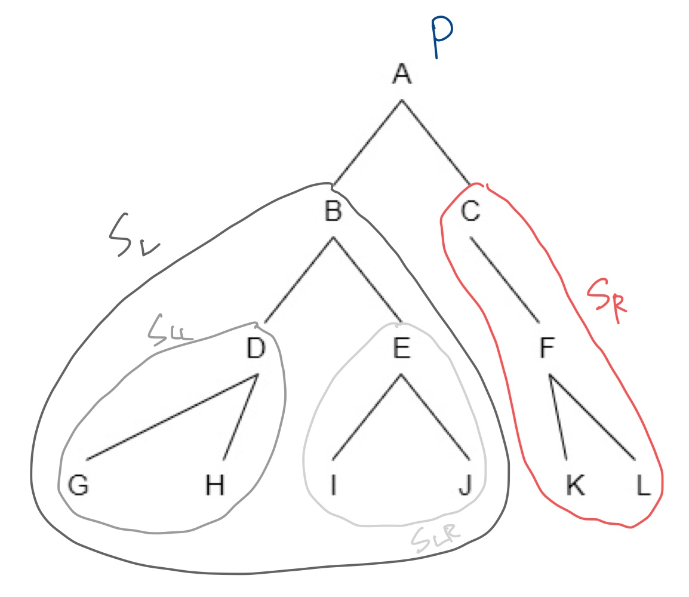

# 트리(Tree)

#### 트리의 종류

트리는 **계층적으로 데이터를 구조화시키기 위한 자료구조**이다. 예를 들어 사람이 100명이 있다고 하면 각 사람마다 직업이 있고, 그 직업에도 종류가 있을 것이다. 만약 배열로 데이터를 저장한다면 예술 분야에 종사하고 있는 사람을 찾으려면 하나하나 뒤져가면서 일치하는 사람들만 저장해야할 것이다. 하지만 트리구조는 아래 그림과 같이 데이터를 구조화시켜 저장하기 때문에 보기도 좋고 찾기도 쉽다.

## 용어 정리

트리를 구성하는 항목 모든 항목을 **노드**(*Node*) 또는 **정점**(*Vertex*)라고 한다. 예를 들어, 위의 그림에서 직업, 예술가, 바흐, 아인슈타인등 모든 항목을 노드라고 부르고 예술가, 학자 노드들을 직업 노드의 **자식 노드**, 음악가 노드를 바흐, 모차르트 노드의 **부모 노드**라고 한다. 직업 노드는 루트 노드라고 부르며, 이 트리를 '트리 직업'이라고 부른다. 즉, 루트 노드가 트리의 이름을 결정한다. 위의 트리에서 예술가, 음악가 화가 이렇게 잘라서 보았을 때 부분부분의 구조들을 **서브 트리**라고 부른다. 위의 트리는 예술가, 학자를 루트로 하는 서브트리 두 개를 갖는다. 또한 학자는 과학자인 서브 트리를 가지며, 음악가는 바흐, 모차르트 두 개의 서브 트리를 갖는다. 바흐, 모차르트 등 맨 끝에 있는 노드들은 서브 트리를 갖지 않는데 이러한 노드를 **잎**(*Leaf*)이라고 부른다.

트리에 있는 어떤 노드에 대해 그 노드로 들어오는 선의 개수를 진입 차수, 나가는 선의 개수를 진출 차수라고 한다. 루트 노드는 진입 차수가 0인 노드이며, 잎 노드는 진출 차수가 0인 노드이다. 루트를 제외한 모든 노드는 진입 차수가 1이다. 각 노드의 차수는 진출 차수로 정의한다. 그리고 트리의 차수는 각 노드의 차수 중 최대 차수로 정의한다. 위의 그림에서 트리의 차수는 2차된다. 루트도 잎도 아닌 노드들을 내부 노드라 하고, 같은 부모를 갖는 노드들을 형제 노드라고 한다.  
  
트리에서 각 노드의 레벨(Level)은 루트 노드로부터 그 노드까지 이어진 선(경로)의 길이로 정하며 길이의 단위는 해당 노드에서 루트까지 도달하는 선의 개수이다. 위의 그림에서 직업 노드는 레벨이 0 바흐, 모차르트는 레벨이 3이된다.

## 이진 트리

트리에 속한 모든 노드의 차수가 2 이하인 트리를 이진 트리라고 한다. 이진 트리는 수학적으로 이론을 정리하기 쉽고, 컴퓨터 내부에 구현하기도 쉬워서 자주 사용된다. 모든 노드가 2개 이하의 자식을 가지기 때문에 일반성을 잃지 않고 오른쪽, 왼쪽이라는 개념을 부여할 수 있다. 위의 직업 트리는 2진 트리이며 여기서 예술가를 루트로 하는 트리를 직업 트리의 왼쪽 서브트리, 학자를 루트로하는 트리를 직업 트리의 오른쪽 트리라고 한다. 바흐와 모차르트는 각각 음악가의 왼쪽 노드, 음악가의 오른쪽 노드가 된다. 이진 트리에서 각 레벨이 최대 개수 노드를 가질 때 그 트리를 포화(*full*) 이진 트리라고 한다. 루트 레벨을 0이라고 할 때 높이가 k인 포화 이진트리의 노드 개수는 다음과 같다.  
20 + 21 + ∙∙∙ + 2k =   
예를 들어 높이가 3인 포화 이진 트리는 노드가 일곱 개이고, 높이가 10인 포화 이 트리의 노드는 1023개이다.

#### 포화 이진 트리와 완전 이진 트리의 차이

포화 이진 트리는 모든 잎 노드를 제외한 모든 노드의 진출 차수가 2인 트리이고, 완전 이진 트리는 모든 노드들이 왼쪽부터 차례대로 채워진 트리이다.

### 이진 트리 구현 방식

배열로 저장하는 경우 각 레벨에 있는 노드를 차례대로 저장한다. 아래의 그림에서 F는 오른쪽 노드이기 때문에 한 자리 비우고 다음 장소에 F를 저장한다.

이 방식은 완전 이진 트리나 포화 이진 트리라면 낭비되는 공간이 없어 효율적이지만 아래 그림과 같이 한쪽으로 치우쳐있는 트리를 저장하기에는 비효율적이다.

이러한 이유로 이진 트리는 보통 연결 리스트로 구현한다. 연결 리스트의 노드는 왼쪽 서브 트리 포인터, 데이터, 오른쪽 서브 트리 포인터로 구성되어있다.

### 이진 트리 연산

### 순회

순회란 트리의 각 노드를 한 번씩 방문하는 것을 말한다. 트리는 보통 연결 리스트로 구현되며 최초에 루트 노드의 포인터가 주어진다. 즉 루트 노드를 가장 먼저 확인할 수 있다. 그 다음은 왼쪽이나 오른쪽을 선택하여 아래로 내려간다. 또한 한 번 방향을 정하면 그 방향은 항상 같아야 한다.

위의 트리에서 왼쪽 방향으로 내려가기로 정했다면 최초에 루트의 값 A을 방문하고 그 다음 B를 루트로하는 SL 서브 트리에 도달하여 B를 방문한 후 계속 왼쪽으로 내려가며 D, G 순으로 방문한다. 잎 노드에 도착을 하면 더 이상 내려갈 노드가 없으므로 오른쪽의 값인 H를 방문하고 부모 노드로 올라가서 다시 오른쪽에 있는 E를 방문한다. 그런데 그 E에는 자식 노드가 있으므로 다시 왼쪽으로 잎 노드까지 방문해나간다. A-B-D-G-H-E-I-J를 순회하고 나면 SL의 모든 노드들이 방문된 것이므로 SR 서브 트리의 루트로 가서 똑같은 방식으로 순회를 한다. SR을 탐색하게 되면 C-F-K-L이 되므로 전체 방문 순서는 A-B-D-G-H-E-I-J-C-F-K-L이 된다. 이 순회 방법을 **전위 순회**(*PLR*)라고 하며, 간단히 정리하면 다음과 같다.

1. 루트 노드 방문(*P*)
2. 왼쪽 서브 트리 순회(*L*)
3. 오른쪽 서브 트리 순회(*R*)

전위 순회 말고도 **중위 순회**(*LPR*), **후위 순회**(*LRP*)가 있으며 순회 순서는 다음과 같다

#### 중위 순회(*LPR*)
1. 왼쪽 서브 트리를 중위 순회로 순회
2. 루트 방문
3. 오른쪽 서브 트리를 중위 순회로 순회

#### 후위순회(*LRP*)
1. 왼쪽 서브 트리를 후위 순회로 순회
2. 오른쪽 서브 트리를 후위 순회로 순회
3. 루트 방문

#### 중위 순회(LPR)로 방문

중위 순회는 먼저 SL 서브 트리를 방문 후 루트 노드를 방문한다. (SL로 가기 위해 루트 노드를 지나가긴 하지만 방문과는 다르다.) SL의 루트는 B이고 다시 서브트리인 SLL, SLR로 나뉘기 때문에 왼쪽 서브트리인 SLL의 왼쪽 잎 노드 G부터 순회를 시작한다. 그 후 오른쪽 잎 노드인 H를 방문하면 SLL의 방문이 끝나고 SLL의 루트 노드인 D를 방문한다. SLL의 방문이 끝났기 때문에 이어서 SLR을 순회하고 모든 과정을 반복하게 되면 G-H-D-I-J-E-B-K-L-F-C-A 순으로 순회가 된다.