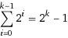
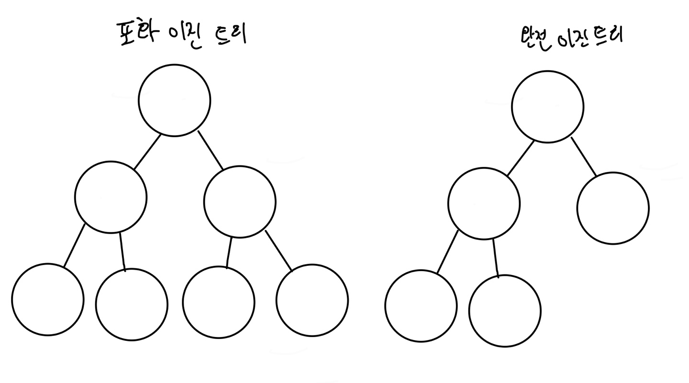
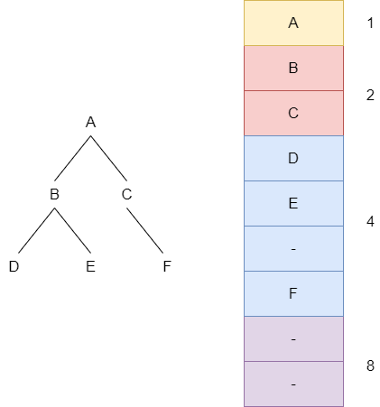
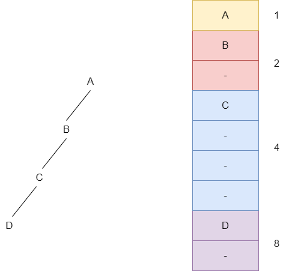
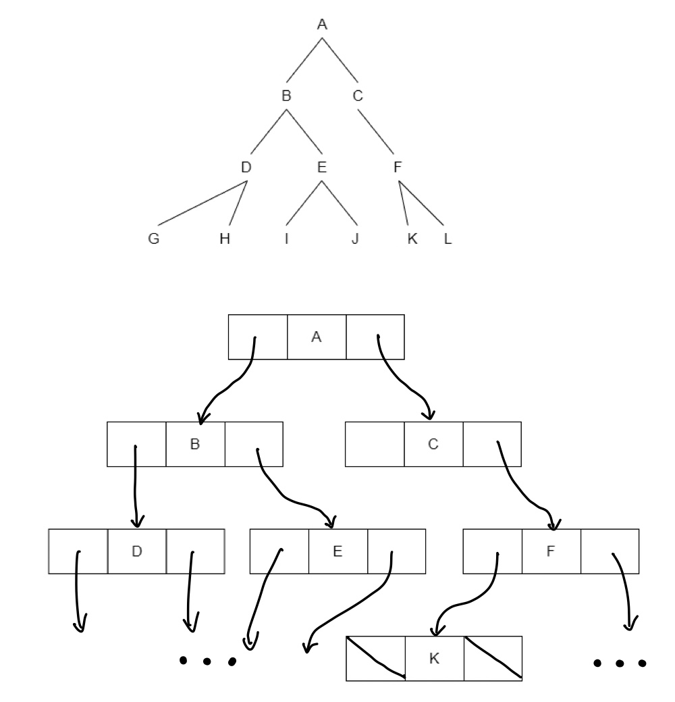
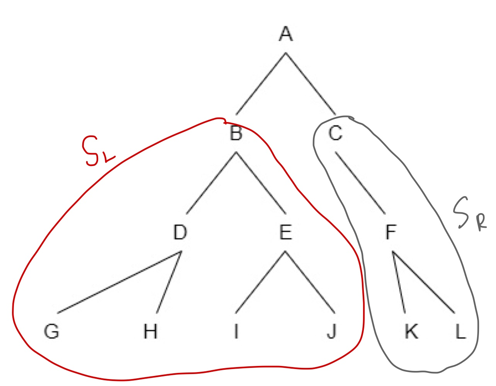
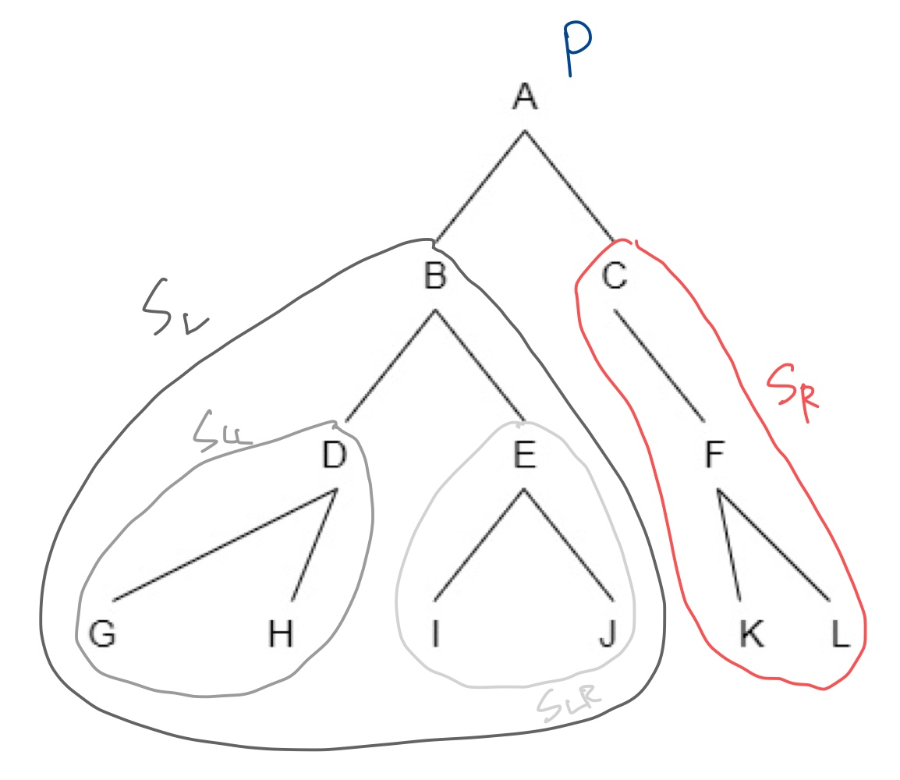
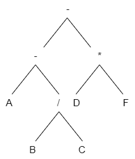
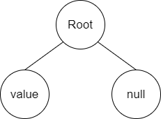

## 이진 트리

트리에 속한 모든 노드의 차수가 2 이하인 트리를 이진 트리라고 한다. 이진 트리는 수학적으로 이론을 정리하기 쉽고, 컴퓨터 내부에 구현하기도 쉬워서 자주 사용된다. 모든 노드가 2개 이하의 자식을 가지기 때문에 일반성을 잃지 않고 오른쪽, 왼쪽이라는 개념을 부여할 수 있다. 위의 직업 트리는 2진 트리이며 여기서 예술가를 루트로 하는 트리를 직업 트리의 왼쪽 서브트리, 학자를 루트로하는 트리를 직업 트리의 오른쪽 트리라고 한다. 바흐와 모차르트는 각각 음악가의 왼쪽 노드, 음악가의 오른쪽 노드가 된다. 이진 트리에서 각 레벨이 최대 개수 노드를 가질 때 그 트리를 포화(*full*) 이진 트리라고 한다. 루트 레벨을 0이라고 할 때 높이가 k인 포화 이진트리의 노드 개수는 다음과 같다.  
20 + 21 + ∙∙∙ + 2k =   
예를 들어 높이가 3인 포화 이진 트리는 노드가 일곱 개이고, 높이가 10인 포화 이진 트리의 노드는 1023개이다.

#### 포화 이진 트리와 완전 이진 트리의 차이

포화 이진 트리는 모든 잎 노드를 제외한 모든 노드의 진출 차수가 2인 트리이면서 잎 노드의 레벨이 모두 같고, 완전 이진 트리는 모든 노드들이 왼쪽부터 차례대로 채워진 이진 트리이다.

### 이진 트리 구현 방식

배열로 저장하는 경우 각 레벨에 있는 노드를 차례대로 저장한다. 아래의 그림에서 F는 오른쪽 노드이기 때문에 한 자리 비우고 다음 장소에 F를 저장한다.

이 방식은 완전 이진 트리나 포화 이진 트리라면 낭비되는 공간이 없어 효율적이지만 아래 그림과 같이 한쪽으로 치우쳐있는 트리를 저장하기에는 비효율적이다.

이러한 이유로 이진 트리는 보통 연결 리스트로 구현한다. 연결 리스트의 노드는 왼쪽 서브 트리 포인터, 데이터, 오른쪽 서브 트리 포인터로 구성되어있다.

### 이진 트리 연산

### 순회

순회란 트리의 각 노드를 한 번씩 방문하는 것을 말한다. 트리는 보통 연결 리스트로 구현되며 최초에 루트 노드의 포인터가 주어진다. 즉 루트 노드를 가장 먼저 확인할 수 있다. 그 다음은 왼쪽이나 오른쪽을 선택하여 아래로 내려간다. 또한 한 번 방향을 정하면 그 방향은 항상 같아야 한다.

위의 트리에서 왼쪽 방향으로 내려가기로 정했다면 최초에 루트의 값 A을 방문하고 그 다음 B를 루트로하는 SL 서브 트리에 도달하여 B를 방문한 후 계속 왼쪽으로 내려가며 D, G 순으로 방문한다. 잎 노드에 도착을 하면 더 이상 내려갈 노드가 없으므로 오른쪽의 값인 H를 방문하고 부모 노드로 올라가서 다시 오른쪽에 있는 E를 방문한다. 그런데 그 E에는 자식 노드가 있으므로 다시 왼쪽으로 잎 노드까지 방문해나간다. A-B-D-G-H-E-I-J를 순회하고 나면 SL의 모든 노드들이 방문된 것이므로 SR 서브 트리의 루트로 가서 똑같은 방식으로 순회를 한다. SR을 탐색하게 되면 C-F-K-L이 되므로 전체 방문 순서는 A-B-D-G-H-E-I-J-C-F-K-L이 된다. 이 순회 방법을 **전위 순회**(*PLR*)라고 하며, 간단히 정리하면 다음과 같다.

1. 루트 노드 방문(*P*)
2. 왼쪽 서브 트리 순회(*L*)
3. 오른쪽 서브 트리 순회(*R*)

전위 순회 말고도 **중위 순회**(*LPR*), **후위 순회**(*LRP*)가 있으며 순회 순서는 다음과 같다

#### 중위 순회(*LPR*)
1. 왼쪽 서브 트리를 중위 순회로 순회
2. 루트 방문
3. 오른쪽 서브 트리를 중위 순회로 순회

#### 후위순회(*LRP*)
1. 왼쪽 서브 트리를 후위 순회로 순회
2. 오른쪽 서브 트리를 후위 순회로 순회
3. 루트 방문

#### 후위 순회(LRP)로 방문

후위 순회는 먼저 SL 서브 트리를 방문 후 루트 노드를 방문한다. (SL로 가기 위해 루트 노드를 지나가긴 하지만 방문과는 다르다.) SL의 루트는 B이고 다시 서브트리인 SLL, SLR로 나뉘기 때문에 왼쪽 서브트리인 SLL의 왼쪽 잎 노드 G부터 순회를 시작한다. 그 후 오른쪽 잎 노드인 H를 방문하면 SLL의 방문이 끝나고 SLL의 루트 노드인 D를 방문한다. SLL의 방문이 끝났기 때문에 이어서 SLR을 순회하고 모든 과정을 반복하게 되면 G-H-D-I-J-E-B-K-L-F-C-A 순으로 순회가 된다. 또한 컴퓨터의 컴파일러는 작성된 코드의 수식을 후위 표기법으로 바꾸어 트리로 구성 후 후위 순회로 계산한다.

### C를 이용한 순회 알고리즘 및 노드 개수 세기(순환 호출)

~~~c
struct node {
    struct node *left;
    struct node *right;
    int info;
};

struct node *nodeptr;

//전위 순회
void preOrder(struct node *tree_ptr) {
    if (tree_ptr) {
        printf("%d", tree_ptr->info);
        preOrder(tree_ptr->left);
        preOrder(tree_ptr->right);
    }
}

//중위 순회
void inOrder(struct node *tree_ptr) {
    if (tree_ptr) {
        inOrder(tree_ptr->left);
        printf("%d", tree_ptr->info);
        inOrder(tree_ptr->right);
    }
}

//후위 순회
void postOrder(struct node *tree_ptr) {
    if (tree_ptr) {
        postOrder(tree_ptr->left);
        postOrder(tree_ptr->right);
        printf("%d", tree_ptr->info);
    }
}

//노드 개수 세기
int getNodeCount(struct node *root) {
    if (!root) return 0;
    int result = 1;
    result += getNodeCount(root->left);
    result += getNodeCount(root->right);
    return result;
}
~~~

### 이진 트리 생성, 삽입, 삭제

이진 트리의 생성은 이중 연결 리스트를 사용하여 구현하면 된다. 먼저 루트 노드를 생성한 뒤 자식 노드로 연결할 하나 더 생성한 다음 원쪽이나 오른쪽 포인터에 생성된 노드의 주소 값을 넣어주면 된다. 그렇게 되면 나머지 방향의 포인터는 null 값을 가지고 아래와 같은 모양이 된다.

그런데 이 만들어진 트리를 이미 포인터 값이 존재하는 다른 트리의 노드에 연결하고 싶다면 문제가 발생한다. 바로 원래 있던 노드의 값이 이탈되면서** 실제론 사용되지 않지만 메모리만 차지하는 메모리 누수가 발생하기 때문이다. 이러한 문제는 프로그램에서 심각한 문제를 일으킬 수 있기 때문에 주의해야 한다.** 만약 이러한 문제를 발생 시키지 않으려면 원래 있던 노드를 삭제 후 메모리를 반환하고 그 자리에 삽입될 트리를 넣어야 할 것이다. 만약 삭제해야 될 노드가 잎 노드라면 포인터 값을 null로 지정 후 메모리를 반환하면 되지만 노드가 잎이 아니라면 그 노드의 자식 노드를 어떻게 처리해야 할지 결정한 후 삽입을 해야한다. 이 결정은 전적으로 프로그래머의 몫이 될 것이다.
