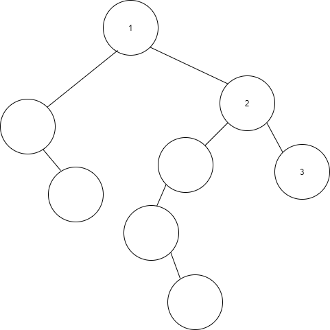

# 숲

0개 이상의 분리된 트리 모임을 숲이라고 한다. 트리에서 루트나 다른 노드를 제거하면 만들 수 있으며, 반대로 숲을 연결하면 트리가 만들어진다.

## 숲의 종류

위와 같이 한 개의 노드만을 가지고 있는 트리도 숲, 2개 이상의 노드로 이루어진 트리도 숲이며 저 위의 세 트리를 합친 모임도 숲이다. 심지어 아무 노드도 없는 트리(공집합)조차 숲이라고 한다.

## 숲을 이진 트리로 변환하기

> 트리 T1, T2, ..., Tn으로 구성된 숲에 대한 이진 트리 BTi~n은 다음과 같다.
> 1. n = 0이면 BT0은 빈 이진 트리
> 2. n = 1이면 BT1 = T1BT
> 3. n >= 2이면 이진 트리의 왼쪽 노드에는 첫 번째 서브 트리가 오고 오른쪽 노드에는 나머지 노드들이 온다.

각 트리(Ti)를 이진 트리로 바꾼 후(TiBT) TiBT의 **루트는 왼쪽 서브트리만 갖게한다.** 다음으로 TiBT의 루트를 최상위 루트로 하고 왼쪽 자식은 그 왼쪽 서브트리, 오른쪽 자식들은 나머지들의 이진트리(BT2~n)가 되도록 한다. 오른쪽 자식들은 순환적으로 계속 생성된다.

예를 들어 위와 같은 숲이 있다고 할 때, 각 각을 이진 트리로 변환하면 다음과 같다.

왼쪽부터 각각 T1BT, T2BT, T3BT

T1BT의 오른쪽 자식으로 T2BT를 지정하고, T2BT의 루트의 오른쪽 자식으로 T3BT으로 지정하면 변환이 끝난다.

