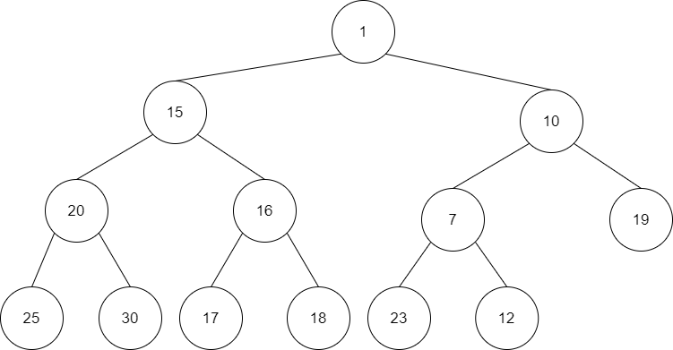

# 힙(Heap)

**힙은 피라미드 모양처럼 쌓아올린 더미 형태의 자료구조이다.** 피라미드 형태는 무언가를 꺼낼 때 아래에 있는 데이터부터 꺼낸다면 틀이 깨지거나 무너질 것이다. 꼭대기부터 꺼내야 그 모양이 유지되며 안정적인 형태가 되는데, 힙도 피라미드 구조와 마찬가지로 **꼭대기부터 데이터를 우선 꺼내는 구조**이다. 삽입과 삭제가 용이하며, **삽입 후 모든 데이터를 꺼내면 정렬되어 나오기 때문에 데이터를 정렬하는 데 많이 사용된다.**

## 우선순위 큐

힙을 설명하려면 우선순위 큐라는 자료구조를 알아야 하는데. 큐는 먼저 들어간 데이터가 먼저 삭제되는 FIFO(First In First Out)의 구조인데 우선순위 큐는 조금 다르게 데이터가 먼저 들어왔더라도 우선순위에 따라 데이터가 삭제되는 구조이다.

### 우선순위 큐의 작동 방법

우선순위 큐를 배열로 구현한 경우 일반 큐와 마잔가지로 데이터가 들어가는 *rear*, 데이터가 삭제되는 *front*가 존재한다. 우선순위 큐는 *front*가 제일 작은 수를 가리키고 나머지 데이터는 무작위로 순서를 이루는 형태로 이루어져있다.

여기서 1을 삭제하고 3을 삽입한다고 하면 다음과 같이 변경될 것이다.

일반 큐의 경우라면 위의 그림과 같이 데이터가 추가 삭제되고 끝이지만 우선순위 큐는 아래와 같이 나머지 데이터 중 가장 작은 2를 *front*가 가리키게 되고 2가 끌어내려지고 난 빈 공간에 뒤의 데이터 6과 한칸 옆으로 이동하게 된다. 그 후 3이 삽입 되며 *rear*은 3을 가리키게 된다. 만약 삽입되려는 데이터가 *front*가 가리키는 데이터(2)보다 작다면 그 수가 2를 대신하고 2는 *rear*이 가리키는 위치로 끌어내려지게된다.

우선순위 큐는 반드시 배열로 구현해야 하는 것은 아니며 삭제를 하게 되면 가장 작은 데이터를 지워야한다는 것만 지켜진다면 어떤 식으로 구현하든지 상관없다.

## 힙의 종류와 구조

우선순위 큐의 작동 방법은 정해져있지만 어떻게 구현하는지에 대한 방법은 정해져있지 않은데, 그 중 하나의 대표적인 사례가 힙이다. 힙은 **최소힙과** **최대힙** 2가지가 있으며 아래의 그림은 **완전 이진 트리로 구성되어있다.**

최소힙은 루트가 최소값이며, 최대힙은 루트가 최대값이다. 그리고 트리의 모든 노드들은 자식의 값보다 크거나(최대힙) 작다(최소힙). 그러나 트리의 레벨에 따라 데이터가 순서를 가지진 않는다. 그저 **루트가 가장 작거나 큰 값을 가지면 되고, 부모는 자식보다 크거나 작은 값을 가지면 된다.**

### 힙이 아닌 트리의 예

왼쪽 트리는 완전 이진 트리가 아니며, 오른쪽 트리는 8과 9의 위치가 바뀌어야 최소힙이 되므로 현재는 힙이 아니다.

## 삭제 및 삽입 연산

힙은 완전 이진 트리이기 때문에 배열로 구현하여도 데이터 공간 낭비가 거의 없다. 또한 연결 리스트로 구현하면 실행 시간이 배열보다 오래 걸리기 때문에 보통 배열로 구현한다.

### C를 이용하여 최소힙의 데이터 삽입, 삭제 구현

~~~c
//힙 구조체 정의
typedef struct {
    int heap[MAX_DATA];
    int heapSize;
} heapType

//삭제 연산
int deleteHeap(heapType *h) {
    int parent, child;
    int item, temp;

    item = h->heap[1]; //루트 노드 삭제
    //마지막 노드를 임시로 루트 자리로 옮김(완전 이진트리가 되어야 하기 때문)
    temp = h->heap[(h->heap_size)--]; 
    parent = 1;
    child = 2;

    while (child < h->heap->heap_size) {
        //임시로 만든 루트 값(가장 작은데이터)와 자식 노드의 값을 비교
        if ((child < h->heap_size) && (h->heap[child]) > h->heap[child + 1]) {
            child++;
        }
        //루트의 값이 자식보다 작다면 삭제 종료
        if (temp <= h->heap[child]) {
            break;
        }

        //루트가 더 크다면 자식과 교환
        h->heap[parent] = h->heap[child];
        parent = child;
        child * 2;
    }

    h->heap[parent] = temp;
    return item;
}

void insertHeap(heapType *h, int item) {
    int i;
    //힙의 크기 증가
    i = ++(h->heap_size);

    // 크기를 부모 노드와 값을 비교하며 크기가 더 작다면 위로 올림 (자식 노드의 위치가 i면 부모 노드의 위치는 i/2 임)
    while ((i != 1) && (item < h->heap[i / 2])) {
        h->heap[i] = h->heap[i / 2];
        i /= 2;
    }

    h->heap[i] = item;
}
~~~

### 삭제 순서

마지막 노드를 루트로 옮김

5와 23 교환

... 반복 ...

삭제 연산 종료

### 삽입 순서

7삽입

7과 12 교환

7과 10 교환 후 종료