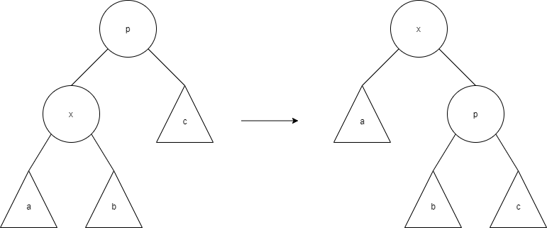
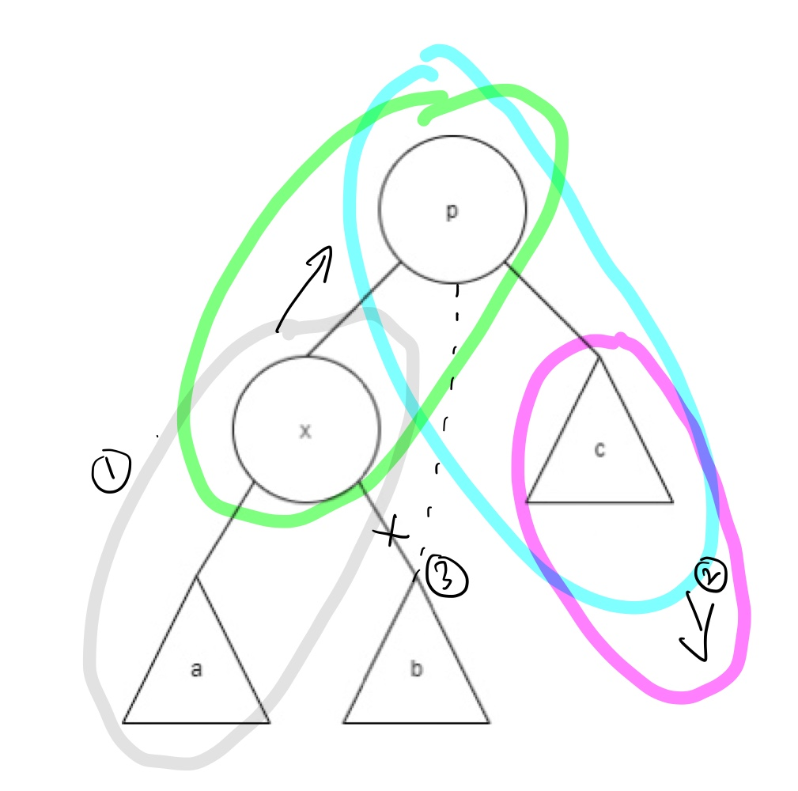

# 휴리스틱(huristic) 알고리즘을 이용한 BS 트리

BS 트리의 성능은 트리 구조와 특정 노드의 접근할 확률에 영향을 받는다. 같은 데이터라도 구조에 따라 차이가 날 수도 있다는 뜻이다. 즉 어떤 정점이 탐색될지, 어떤 정점이 삽입되거나 삭제될지에 대한 정보를 예측할 수 없는 상황에서 최적의 BS 트리 종류를 확언할 수 없다는 뜻이다. 그렇지만 적당한 휴리스틱 알고리즘을 사용한 BS 트리의 성능이 최적의 BS 트리에 가깝다는 것이 많은 연구 결과로 밝혀졌기 때문에 쓸만한 BS 트리를 구성할 수 있게 되었다. 예를 들면 다음과 같은 휴리스틱이 잘 알려져있다.

1. 자주 탐색하는 키를 가진 노드를 트리의 루트에 가깝게 놓는다.
2. 트리의 균형이 맞도록 유지한다. 즉, 각 노드에 대해 왼쪽과 오른쪽의 서브트리가 가능한 같은 수의 노드를 갖게한다.

## 변형된 BS 트리의 종류

세 종류의 트리를 간단하게 살펴보자.

### Splay 트리

Splay 트리는 자주 탐색하는 키를 가진 노드를 루트에 가깝게 위치하도록 구성한 BS 트리이다. Splay 연산을 적용하여 최근에 접근한 노드를 루트에 위치시켜 트리를 재구성한다. 즉, 가장 최근에 사용된 노드가 트리의 루트에 올 때까지 Splay 연산을 반복하여 적용한다. 다음은 Splay 연산을 나타낸다. g는 최근에 접근한 노드이고, p는 x의 부모 노드, g는 x의 조부모 노드이다.

1. Zig: p가 트리의 루트이면 p와 x의 간선 연결을 회전시킨다.
2. Zig-Zag: p가 루트가 아니고 x와 p가 동일하게 왼쪽 자식 또는 오른쪽 자식이면 p와 g의 간선 연결을 회전시키고, 그 다음에 x와 p의 간선 연결을 회전시킨다.
3. Zig-Zag: 만약 p가 루트가 아니고 x가 왼쪽 자식 p가 오른쪽 자식이면 x와 p의 간선 연결을 회전시키고, 그 다음에 x와 x의 새로운 부모 p와의 간선 연결을 회전시킨다.

#### Splay 연산

#### 연산 순서

1. x-a가 p-x 자리로 올라간다. 이 때 서브 트리 b의 연결이 끊어진다
2. p-c가 오른쪽 아래로 내려간다. 이 때 전 단계에서 올라온 x와 p를 연결한다.
3. 첫 단계에서 연결이 끊긴 서브트리 b를 P의 왼쪽 서브 트리로 연결한다.

### 균형을 유지하는 트리

위에 설명한 휴리스틱 2가지에서 2번째를 적용한 균형 트리 부류는 1을 적용하여 구축한 트리보다 일반적으로 성능이 좋다. 그러나 노드의 삽입과 삭제가 일어날 때, 노드 키값과 서브 트리 키값 사이의 관계를 유지하면서 균형을 유지시키는 것이 쉽지 않다.균형을 유지하기 위해서는 많은 노드들이 이동해야 하기 때문이다. BS 트리의 탐색 성능을 개선하면서 균형을 유지하는 데 따르는 수고를 줄이려면 제한 조건을 완화하여 트리가 균형이 아닌 것을 허용해야 한다. 또한 무너진 균형의 정도는 작아야하고, 평균 탐색 길이도 완전 균형 트리의 탐색 길이와 크게 차이나지 않아야 한다. 이러한 조건에 맞는 변형 BS 트리가 바로 AVL 트리와 BB 트리이다. 완전 균형 트리를 유지하기 위해서는 O(n)개의 노드를 옮겨야 하는데 반해, 위의 두 트리는 규형 유지 조건이 좀 더 완화되었기 때문에 O(log2n)개의 노드를 옮기면 된다.

#### AVL 트리

AVL 트리는 거의 완전한 균형 트리의 한 형태로 **높이가 균형 잡힌 높이 균형 트리(height balanced tree)이다.** 트리의 각 노드 vi에 대해서 AVL 조건을 만족할 때 그 트리는 높이가 균형잡혔다라고 한다.

> AVL 조건: 노드 vi의 왼쪽 서브 트리 높이와 vi의 오른쪽 서브 트리 높이가 최대 1만큼 차이난다. 트리의 높이란 노드가 가질 수 있는 가장 높은 레벨에 1을 더한 값이다.

AVL 트리는 직접 탐색 성능이 매우 좋다. AVL 트리는 완전 균형 트리보다는 균형이 덜 잡힌 상태이지만 탐색 경로의 길이는 크게 다르지 않으므로 완전 균형 트리와 거의 비슷한 성능을 가진다. 만약 삽입 및 삭제 연산에 의해 균형이 깨진다면, 균형을 잡기 위해 노드 들을  재구성해야한다. 이러한 재구성 과정을 회전(rotation)이라 한다.

#### BB 트리

AVL 트리가 높이에 초점을 맞췄다면 BB 트리는 무게에 초점을 맞춘 BS 트리이다. 트리의 무게란 트리에 속한 잎 노드의 개수로 정의하며 **무게 균형이 잡힌 트리를 무게 균형 트리 또는 BB 트리라고 한다.** 무게 균형 트리는 각 노드의 양쪽 서브 트리 무게가 균형을 유지하는 트리이다. BB 트리의 평균 탐색 길이 역시 이상적인 균형 트리와 거의 비슷하다. 또한 삽입 및 삭제 연산시 균형을 잃게 되면 AVL 트리와 마찬가지로 회전 연산을 적용하여 균형을 유지시킨다.