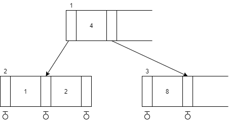
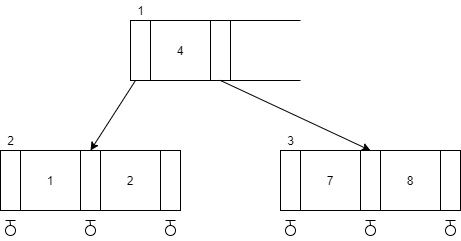
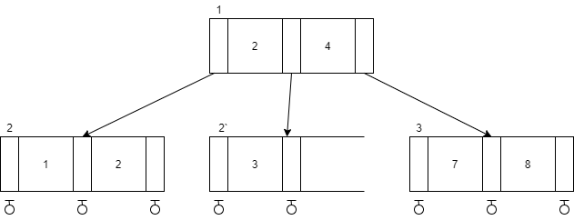
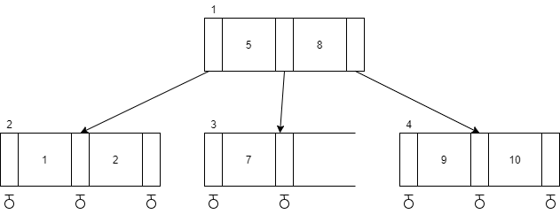
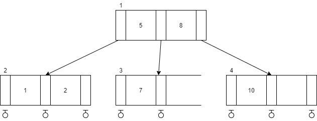
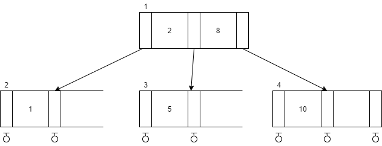
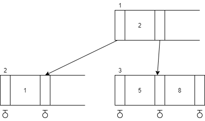

# 2-3 트리

2-3 트리는 차수가 2 또는 3인 내부 노드를 갖고 다음 조건을 갖는 트리이다.

> 1. 각각의 내부 노드는 2-노드이거나, 3-노드이다. 2-노드는 키값을 한 개, 3-노드는 키값을 두 개 갖는다.
> 2. lchild, mchild를 각각 2-노드의 촤측 및 중간 자식이라 하고, lkey가 이 노드의 키값이라 하자. 그러면 루트가 lchild인 모든 2-3 서브트리의 키 값은 lkey보다 크다.
> 3. lchild, mchild, rchild를 각각 3-노드의 왼쪽, 중간, 오른쪽 자식이라 하고, lkey 및 rkey를 이 노드의 두 키값이라 하자. 그러면 다음이 성립한다.  
>>  1) lkey < rkey  
>> 2) 루트가 lchild인 모든 2-3 서브트리의 키값은 lkey보다 작다.  
>> 3) 루트가 mchild인 모든 2-3 서브트리의 키값은 rkey보다 작고 lkey보다 크다.  
>> 4) 루트가 rkey인 모든 2-3 서브트리 데이터는 rkey보다 크다.
> 4. 모든 잎 노드는 같은 레벨에 있다.

또한 2-3트리는 B 트리 계열과 거의 같은 성능을 유지하면서 상대적으로 삽입, 삭제,가 용이하다.

#### 2-3 트리의 구조

위의 그림에서 노드 1과 3은 2-노드이고, 노드 2는 3-노드이다. 작은 원으로 표시된 것은 잎 노드이다. 또한 위의 그림에서 노드는 총 3개 키는 네 개이다.

> #### 2-3 트리의 키 개수
> 높이가 h인 2-3 트리의 키 개수는 2h - 1개에서 3h - 1개 사이이다.

## 2-3 트리의 탐색

2-3 트리의 탐색은 이진 트리 탐색 알고리즘을 확장하여 구현할 수 있다.

~~~c
typedef struct TwoThree *toThreePtr;
struct TwoThree {
    int lkey, rkey;
    twoThreePtr lchild, mchild, rchild;
};

twoThreePtr search(twoThreePtr t, index x) {
    while(t) {
        switch(compare(x, t)) {
            // 값이 같은 경우
            case 1: t = t->lchild;
                break;
            // 왼쪽 키값보다 작은 경우
            case 2: t = t->mchild;
                break;
            // 왼쪽 키값보다 크고 오른쪽 키값보다 작은 경우
            case 3: t = t->rchild;
                break;
            // 오른쪽 키값보다 큰 경우
            case 4: return t;
        }
    }
    return null;
}
~~~

2-3 트리 노드의 데이터 구조를 보면 포인터를 세 개까지 가질 수 있음을 알 수 있다.

## 2-3 트리의 삽입

삽입 알고리즘은 비교적 간단하다. 위의 그림에 키값 7을 삽입하는 것을 예로 들자면, 먼저 7이 트리에 있는지 확인 한 후 없으면 삽입을 하게 되는데, 7의 존재를 탐색하는 과정은 노드 3에서 종료되고 노드 3은 키값을 하나만 가지고 있으므로 아래와 같이 삽입하면 된다.

키값 3이 삽입해보자. 우선 키값이 존재하는 지에 대한 탐색은 노드 2의 오른쪽 잎 노드에서 종료될 것이다. 그런데 더 이상 삽입할 공간이 없으므로 새로운 노드를 생성 후 삽입을 해야 한다. 새로운 노드를 2`라고 하고 여기에 현재 노드 2의 키값들 1,2와 삽입할 키값 3중에서 가장 큰 것들이 들어가고 각 노드는 키 1개씩을 갖도록 수정한다. 

### 2-3 트리의 삽입
~~~c
void insert(twoThreePtr t, int y) {
    twoThreePtr q, p, r;
    if (!(*t)) {
        newRoot(t, y, NULL);
    } else {
        p = findNode(*t, y);
        if (!p) {
            fprintf(stderr, "The key is currently in the tree \n");
            exit(1);
        }
        q = NULL;
        for (;;) {
            if (p->rkey == INT_MAX) {
                putIn(&p, y, q);
                break;
            } else {
                split(p, &y, &q);
                if (p == *t) {
                    newRoot(t, y, q);
                    break;
                } else {
                    p = delete();
                }
            }
        }
    }
}
~~~

* `newRoot`: 첫 노드를 생성하는 함수이며, 인자로 새루트의 lchild, 자신의 키값, mchild를 넘겨준다. 새 루트에 대한 포인터는 첫 번째 매개변수에 할당한다.
* `findNode`: 키가 2-3 트리 t내에 있는지 여부를 탐색한다. 키가 t내에 있다면 null을 반환하고 없으면 잎 노드 p를 반환한다. 잎 노드 p로부터 루트 노드 t에 도달할 때 까지 조상 노드들을 알 수 있도록 전역 스택을 생성한다.
* `putIn`: 노드 p에 y를 삽입하는 함수이다. 우선 y의 오른쪽 서브트리 q를 놓고 y가 lkey이면 q는 mchild가 되고, lkey와 mchild의 이전 값들은 rkey와 rchild로 옮긴다. y가 rkey이면 q는 rchild가 된다.
* `split`: 노드 분리함수로서 새 노드 q를 생성한다. 노드 q에는 가장 큰 키값이 저장되고 가장 작은 키값은 노드 q에 남는다.
* `delete`: 전역 스택으로부터 하나의 노드를 제거하는 함수이다.

### 2-3 트리의 삭제

삭제는 삽입보다 복잡하다. 잎이 아닌 노드의 키를 삭제하면 그 곳을 다른 키로 대체해야 하기 때문이다. 일반적으로 삭제한 키의 왼쪽 서브트리 안에서 가장 큰 값을 갖는 키나 오른쪽 서브트리 안에서 가장 작은 값을 갖는 키를 선택한다. 다음 그림을 통해 예를 들자면 먼저 아래와 같은 2-3 트리가 존재한다고 하자.  

먼저 9를 삭제하게 되면 다음 그림과 같이 된다.  

다음으로 7을 삭제하면 노드 3이 공백이 되므로 회전이라는 2-3 트리 연산을 실행한다. 회전은 3-노드인 형제가 있는 경우 키값 중 하나를 부모 노드로 올리고 부모노드로부터 키값 하나를 가져다 빈 노드를 채우는 것이다.  

마지막으로 10을 삭제해보면 마찬가지로 노드 4가 공백이 되지만 3-노드인 형제가 없으므로 회전연산을 할 수 없으므로 결합 연산을 한다. 결합이란 하나를 없애고 형제와 합치는 것을 말한다.
