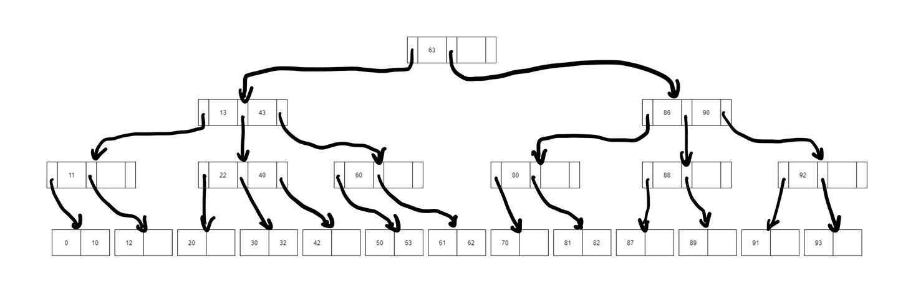
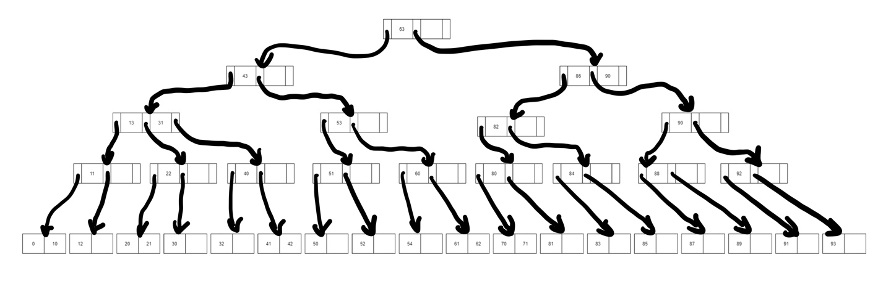
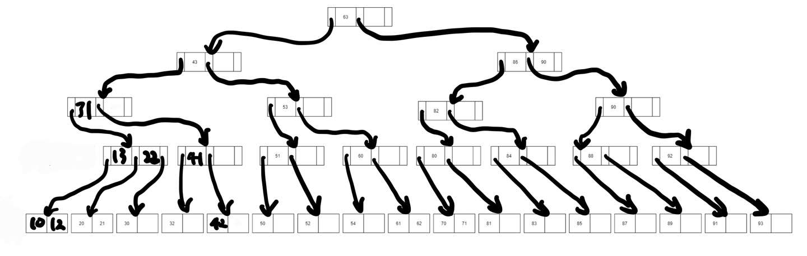

# B 트리

노드의 가지 개수를 늘리는 것만이 m원 탐색 트리의 성능을 향상키는 유일한 방법은 아니다. **BS 트리를 다룰 때 처럼 트리의 균형을 유지하여 탐색 성능을 개선시킬 수 있다.** m원 탐색 트리는 서브 트리의 균형에 대해서는 제한하지 않기 때문에각 노드가 자식을 많이 갖게 하여 트리의 높이를 줄이고 전체적으로 균형을 유지한다면 탐색 성능을 더욱 향상시킬 수 있다. 다음 조건을 만족하는 m원 탐색 트리를 차수가 m인 B트리라고 한다. 이 트리는 **인덱스 구조를 구현하는 데 가장 일반적으로 사용하는 방법이다.**

> 1. 루트와 잎 노드를 제외한 트리의 각 노드는 최소 [m/2] 개의 서브 트리를 갖는다.
> 2. 트리의 루트는 최소한 두 개의 서브 트리를 갖는다.
> 3. 트리의 모든 잎 노드는 같은 레벨에 있다.

조건 2는 트리를 처음부터 분리되도록 한다. 루트부터 최소한 두 개의 서브 트리를 갖게하는 것이다. 그리고 조건 3에 의해 거의 균형을 맞추게 한다. 즉, 내부를 충분히 채우고 잎 노드 중 자식을 갖지 않은 것이 있는 한 새로운 가지(높이 증가)가 발생하지 않게 하는 것이다.

B 트리는 같은 크기를 가진 이상적인(노드가 꽉꽉 채워진 최적의 상태의) 트리보다는 탐색 경로가 길 수 밖에 없다. 하지만 B트리를 유지하는 것이 이상적인 탐색 트리를 유지하는 것보다 쉽다. 즉, AVL 트리 또는 BB 트리 등을 사용하는 이유와 같다고 볼 수 있다(키의 삽입과 삭제할 때 드는 비용이 적기 때문이다.). 그럼에도 최대 탐색 길이는 같은 차수를 갖는 균형 잡힌 m원 트리와 거의 비슷하다.

## 차수가 3인 B 트리

차수가 m인 B트리의 각 노드는 m원 탐색 트리의 노드 구조와 동일하다. 그리고 B 트리를 인덱스로 사용할 때도 각 키값에 대응하는 레코드를 가리키는 주소 포인터가 노드 구조에 포함된다. 또한 B 트리에서 특정 키 값을 탐색하는 방법은 m원 탐색 트리와 같다.

### 노드 삽입

 B트리는 노드를 삽입, 삭제할 때 트리가 정해진 균형을 유지하도록 해야 한다. 삽입 알고리즘을 살펴보면 다음과 같다.

 > 1. 삽입할 위치를 찾기 위해 노드의 키값을 좌에서 우로 탐색한다.
 > 2. 노드에 빈 자리가 있으면 삽입 후 종료한다.
 > 3. 노드가 꽉 찼으면 노드를 두개로 분리하고 키와 포인터를 새 노드에 반씩 할당한다.  
 > 3-1. 잎 노드 키값과 삽입 노드 키값 중에서 중간값을 선택한다.  
 > 3-2. 선택된 중간값보다 작은 키값을 갖는 것은 왼쪽 노드에, 큰 값을 갖는 것은 오른쪽 노드에 넣는다.  
 > 3-3. 중간값을 가지는 노드의 키와 포인터를 부모 노드에 삽입한다. 만일 부모 노드가 루트 노드이면 두 노드를 가리키도록 수정한다.

위의 그림에 있는 B 트리에 21, 41, 54, 52, 51, 31, 71, 85, 83, 94를 차례대로 삽입 해보면 다음 순서과 같다.

**21**: 키값 20 옆에 그대로 삽입한다.  
**41**: 기존에 있는 42보다 작으므로 42를 오른쪽으로 옮기고 41을 삽입한다.  
**54**: 키값 60의 옆에 놓여야 하지만 노드가 꽉 찼기 때문에 노드를 분리하여 새로운 노드에 삽입한다. 그리고 중간 값인 53을 부모 노드로 옮긴다.  
**52**: 50과 53이 분리되었기 때문에 50 오른쪽의 빈 공간에 삽입한다.  
**51**: 50과 52 사이에 삽입해야 하기 때문에 먼저 50과 52를 분리한 후 중간 값인 51을 부모로 옮긴다. 그런데 그 부모에 노드도 꽉 차있기 때문에 부모 노드 또한 분리한다. 53, 60이 쌍을 이루고 있는 노드를 분리하고 중간 값인 53은 부모 노드로 보내고 51과 60을 각각의 노드 왼쪽에 삽입한다. 그런데 부모 노드인 13과 43 키값이 있는 노드도 꽉 차있기 때문에 노드를 분리하고 중간값인 43을 부모 노드로 옮긴다. 그 후 키값 53 왼쪽 포인터는 키값 51 노드를 가리키도록 수정하고 오른쪽 포인터는 키값60인 노드를 가리키도록 수정한다.  
**43**: 63이 있는 노드에 삽입하고 포인터를 수정한다. 즉, 키값 43 왼쪽 포인터는 키값 13인 노드, 오른쪽은 키값 53인 노드를 가리키도록 한다. 키값 63 오른쪽 포인터는 그대로 둔다.  
**31, 71, 85, 83**: 삽입할 공간들이 다 비어있기 때문에 그대로 삽입한다.  
**84**: 삽입시 트리의 높이가 한 레벨 올라간다.

#### 삽입이 완료된 B 트리

### 노드 삭제

노드의 삭제는 삭제보다 더 복잡하다. B 트리이기 위해서는 노드가 정해진 개수인 m 개의 키를 가져야 하는데 삭제 후 개수가 부족하면 해당 노드를 다른 노드와 묶어야하기 때문이다.

삭제 알고리즘을 살펴보면 다음과 같다.

> 1. 삭제할 키값을 포함한 노드를 찾는다.
> #### 잎 노드에서 삭제하는 경우
> 2. 노드에서 키값을 삭제한다.
> 3. 필요하다면 재배열한다.
>
> #### 내부 노드에서 삭제하는 경우
> 내부 노드 키값은 하위 노드에 대한 기준값(중간값)이기 때문에 삭제 시 대체할 수 있는 적절한 값을 찾아야 한다. 보통 왼쪽 서브트리의 가장 큰 키값 또는 오른쪽 서브트리의 가장 작은 키값으로 대체할 수 있다. 이들은 모두 잎에 위치한다.
> 2. 새로운 기준값(삭제된 자리에 올 키값)을 선택하여 해당 잎 노드에서 삭제하고 그 값을 현재 키값을 삭제한 자리로 옮긴다.
> 3. 기준값으로 대체하기 위해 키를 삭제한 잎 노드가 정해진 개수의 키값을 갖지 않으면 트리를 재배열한다.  
> #### 재배열 방법
> 2. 키값이 부족한 노드의 오른쪽 형제가 존재하고 키가 정해진 개수보다 많다면, 왼쪽으로 회전한다.  
> 2-1. 부모 노드의 기준 키값을 개수가 부족한 노드의 끝으로 이동시킨다. 즉, 기준값을 한 단계 아래로 내려 개수를 채운다.  
> 2-2. 부모 노드의 기준 키값을 오른쪽 형제의 첫 번째 키로 수정해 균형을 맞춘다.
> 3. 키값이 부족한 노드의 왼쪽 형제가 존재하고 키가 정해진 개수보다 많다면, 오른쪽으로 회전한다.  
> 3-1. 부모 노드의 기준 키값을 개수가 부족한 노드의 끝으로 이동한다. 즉, 기준값을 한 단계 아래로 내려 개수를 채운다.  
> 3-2. 부모 노드의 기준 키값을 왼쪽 형제의 첫 번째 키로 수정해 균형을 맞춘다.
> 4. 좌우 형제가 최소 개수의 키를 가지고 있다면, 좌우 형제를 합친다.  
> 4-1. 부모 노드의 기준 키값을 왼쪽 노드의 마지막에 복사한다.  
> 4-2. 오른쪽 노드의 모든 키값을 왼쪽 노드로 옮긴다(왼쪽 노드가 최대 개수의 키를 갖는다).  
> 4-3. 키를 갖지 않는 오른쪽 노드를 삭제한다.  
> 4-4. 부모 노드가 루트이면서 키를 더 이상 갖지 않으면 합쳐진 노드가 새로운 루트가 된다. 그렇지 않고 부모 노드의 키 개수가 정해진 개수보다 작으면, 부모 노드를 재배열한다.

이전에 삽입을 했던 B 트리에서 62, 0, 40, 11을 삭제해보자.

**62**: 잎에 있기 때문에 바로 삭제한다.  
**0**: 잎에 있기 때문에 바로 삭제를 하고 키의 순서를 유지하기 위해 10을 왼쪽으로 이동한다.  
**40**: 40을 삭제하게 되면 해당 노드는 잎 노드가 아니면서 키 값이 하나도 없기 때문에 삭제한 키 오른쪽에 포인터가 가리키는 서브트리에서 가장 왼쪽 키를 가져온다.  
**11**: 삭제 후 재배열 시킨다.

#### 삭제가 완료된 B 트리

