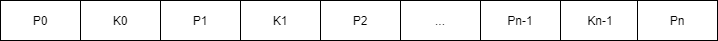
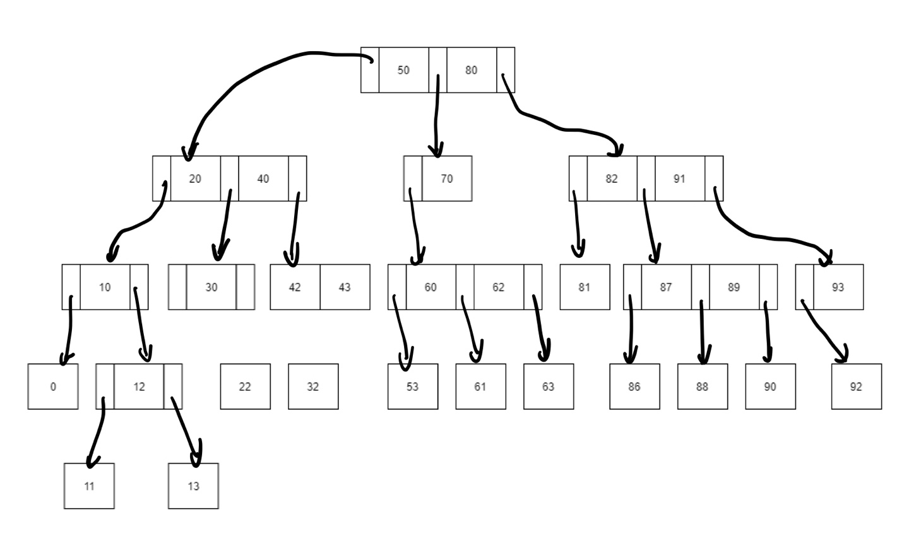

# m원 탐색 트리

m원 탐색 트리는 이진 탐색 트리를 확장한 트리이다. 탐색 트리의 제한을 따르되 두 개 이상 m개 이하의 자식을 가질 수 있다. 정의는 다음과 같다.

> 노드의 구조는 다음과 같다. 여기서 p0, p1, ... pn은 서브 트리에 대한 포인터이고 k0, k1, ..., kn-1은 키 값이다. 또한 n <= m-1이 성립한다.

> 2. i = 0, ..., n - 2인 i에 대하여 ki < ki+1을 만족한다.
> 3. i = 0, ..., n - 1인 i에 대하여 pi가 가리키는 서브트리의 모든 키값은 ki의 키값보다 작다.
> 4. pn이 가리키는 서브트리의 모든 키값은 kn-1의 키값보다 크다.
> 5. i = 0, ..., n인 i에 대해 pi가 가리키는 서브트리는 m원 탐색 트리이다.

## 3원 탐색 트리

위의 그림은 3원 탐색 트리이다. (간단히 하게 위해서 단말 노드는 키값으로만 나타냈고 내부 노드들도 자식이 없는 포인터들은 표시하지 않았다.) 모든 노드는 최대 세 개까지 서브트리를 가질 수 있다. 또한 탐색 트리의 특징인 왼쪽 노드부가 오른쪽 노드보다 값이 작다는 것도 확인해보자. 실제 응용에서 키값은 보통 문자열이다. 간단히 C로 구현하면 아래와 같다.

~~~c
//m원 트리 구조체 정의
struct Node {
    //서브트리의 개수
    int n;
    struct RecType {
        //서브트리 포인터
        struct Node *ptr;
        //key 값
        int key;
        //key에 대응되는 값을 가리키는 포인터
        struct RecType *addr
    } keyPtrS[n - 1];
    struct Node *keyPtrN;
}

struct Node *nodePtr;
struct RecType *recPtr;

//탐색 함수
//탐색을 위한 key 값과 루트 노드 포인터를 매개변수로 받음
struct RecType *search(int key, struct Node *r) {
    int i;
    extern struct Node node;
    if (r == NULL) return NULL;
    else {
        i = 0;
        while (i < r->n && key > r->keyPtrS[i].key) {
            i++;
        }
        if (i < r->n && key == r->keyPtrS[i].key) {
            return r->keyPtrS[i].addr;
        } else if (i < r->n) {
            return serach(key, r->keyPtrS[i].ptr);
        } else {
            return search(key, r->keyPtrN);
        }
    }
}
~~~

m원 트리를 위한 노드는 중첩 구조체로 정의한다. 왜냐하면 m원 트리의 노드는 m개까지 서브트리를 가질 수 있기 때문이다. **일반적으로 노드의 가지 개수가 많을 수록 최대 탐색 길이는 짧아진다. 같은 개수라도 깊이가 더 얕기 때문이다.** 예를 들어 키가 255개인 경우 4원 트리로 구성하면 최대 경로 길이가 4가 되어, 네 번 만에 키를 찾을 수 있다. 키가 65,635개인 경우 16원 트리로 구성하는 것 또한 최대 경로의 길이가 4가 된다.
