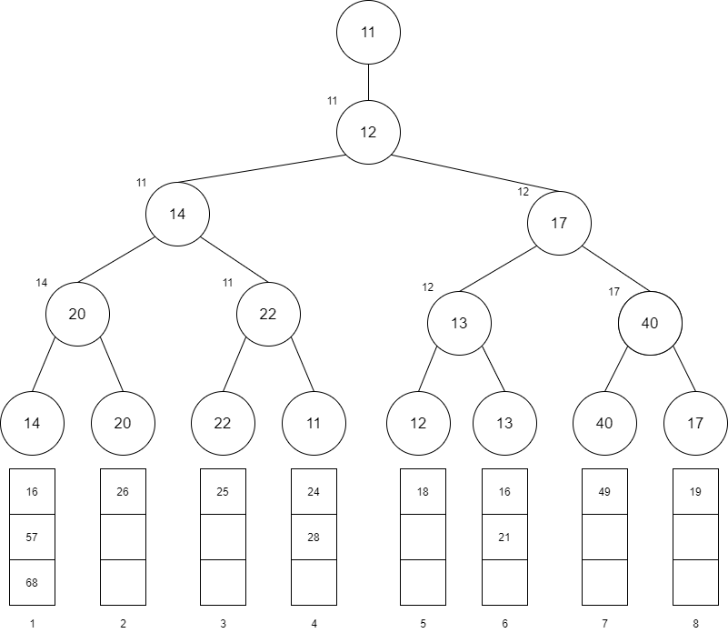

# 선택 트리

선택트리란 합병 정렬에 사용되는 트리이다. 합병 정렬이란 차례로 정렬된 데이터 리스트가 k개 있다고 할 때, 그 리스트 들을 완전한 순서를 유지하는 하나의 리스트로 만드는 정렬 방법이다.

## 합병 정렬 예제

아래와 같이 오름차순으로 정렬한 여덟 개의 리스트가 있다고 할 때, 각각의 head에 위치한 데이터 중 가장 작은 값을 선택해서 출력하는 과정을 반복하면 된다.

첫 번째 출력은 4번째 리스트의 head인 11이 되고 그 다음 출력은 5번째 리스트의 12, 그 다음은 6번째 리스트의 13, .. 이런식으로 계속 반복하여 출력하며 1번째 리스트에 있는 68을 마지막으로 출력이 종료된다. 즉 **리스트가 k개인 경우 k-1번 비교하여 각 리스트의 head 위치한 데이터 중 가장 작은 값을 선택하는 방식이다.**

## 선택 트리를 이용한 합병 정렬

선택 트리를 이용하면 비교 횟수를 줄일 수 있다. 선택 트리에는 승자트리와 패자트리 두 종류가 있는데, 먼저 승자트리를 알아보자.

### 승자트리

승자트리는 각 노드가 두 자식 노드보다 더 작은 값을 갖는 완전 이진 트리이다. 승자트리는 작은 값이 승자로 올라가는 토너먼트 형식과 유사하다. 즉, 트리의 각 내부 노드의 값은 두 자식 노드 값 중 작은 값(승자)이다. 결과적으로 **루트 노드는 전체 노드 중 가장 작은 값이 된다.** 루트가 결정되게 되면 그 값을 전체 순서리스트(k개의 리스트를 합병한 리스트)에 출력하고, 트리에서 삭제한다. 그리고 삭제한 데이터를 가지고 있던 리스트의 다음 데이터를 승자트리로 가져와서 승자트리를 재구성한다. 이 과정을 반복하여 k개의 리스트를 하나의 순서 리스트로 합병할 수 있다.

#### 승자트리 구성 전

#### 최초 승자트리 구성

정렬된 리스트 들의 head에 위치한 값 들이 트리의 잎으로 올라간 다음 값을 비교한 후 작은 값 들을 부모 노드로 올리고, 최종적으로 가장 작은 값이 루트의 값이 된다. 루트 노드는 출력 후 삭제된다.

#### 승자트리 재구성

제거된 값이 4번 리스트의 head였으므로 4번 head에 있는 값을 승자트리에 올려 보낸다. 그리고 다시 값을 비교하여 루트에 있는 값을 출력 후 제거한다.

위의 과정 들을 반복하게 되면 하나의 리스트로 정렬할 수 있다.

비교 횟수를 따져보면 최초 승자트리를 구성할 때는 k-1 즉 7회 비교 했지만, 재구성할 때마다 비교 횟수는 푸른점의 개수 처럼 3회만 비교하면 된다. 즉 선택트리를 사용한 경우 트리의 레벨은 log(k-1)이므로 선택트리를 재구성하는 시간은 O(logk)이고 따라서 n개의 데이터를 모두 합병하는 데 필요한 게산 복잡도는 O(nlogk)이다. 또한 승자트리는 완전 이진 트리이기 때문에 왼쪽 자식 노드의 위치를 i라 하면 오른쪽 자식 노드의 위치를 i+1, 부모 노드의 위치를 i/2로 정의하여 배열로 쉽게 구현할 수 있다.

### 패자트리

패자트리는 승자트리와 마잔가지로 각 노드가 두 자식 노드 중 작은 값을 갖는 완전 이진 트리이지만 **루트 노드 위에 최종 승자 값을 저장하는 0번 노드를 가지며, 내부 노드에는 토너먼트의 패자를 저장한다.** 즉, 패자를 부모 노드에 저장하고 승자는 부모의 부모 노드로 올라가서 다시 경쟁한다. 루트 노드에는 마지막 토너먼트 패자를 저장하고, 최종 승자는 0번 노드에 저장한다.

#### 패자트리 구성 전

#### 최초 패자트리 구성

패자를 남기고 승자는 (0번 노드까지) 계속 올라간 후 0번 노드에 있던 11을 제거하고 전체리스트에 저장한다.

#### 패자트리 재구성

경쟁을 계속 반복한다.