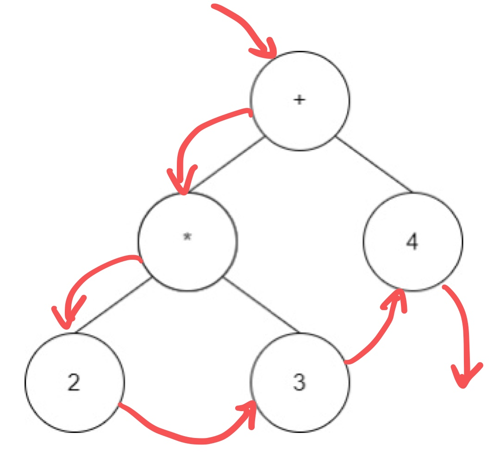
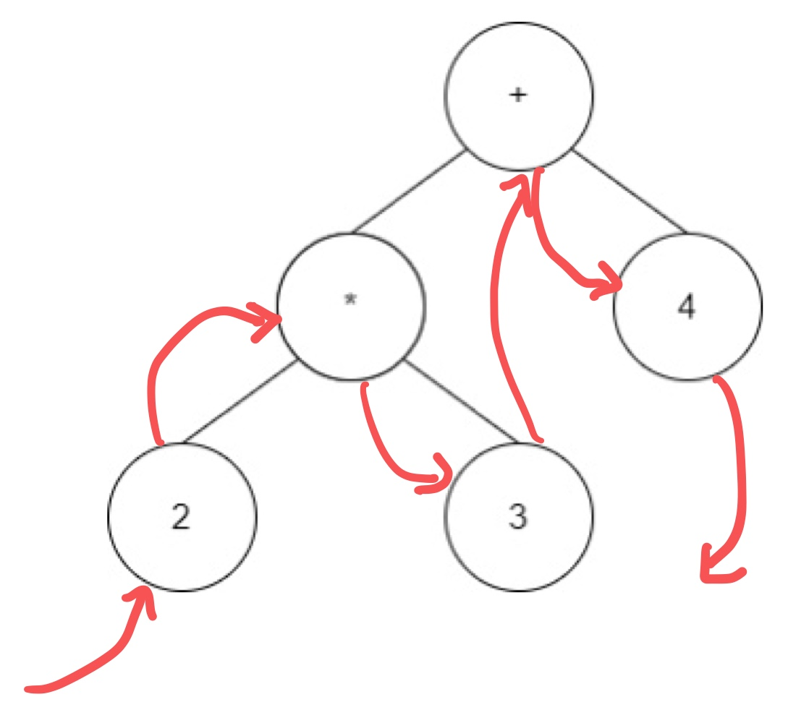
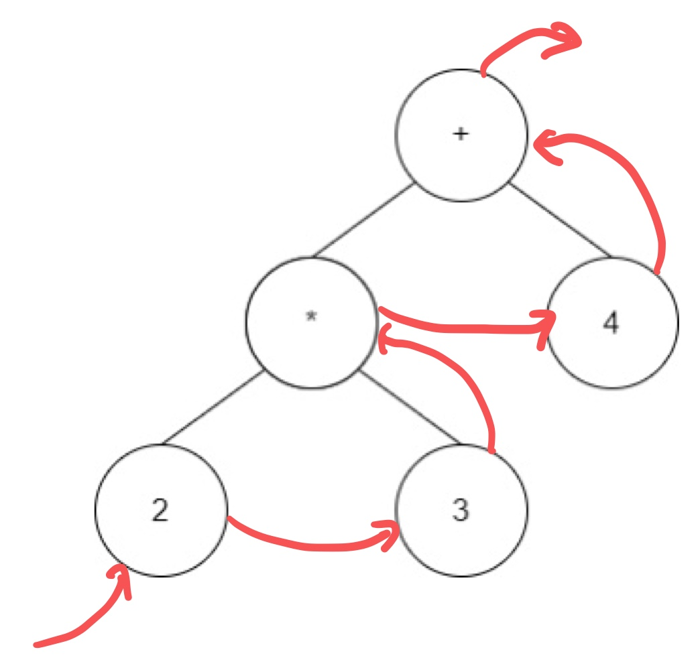
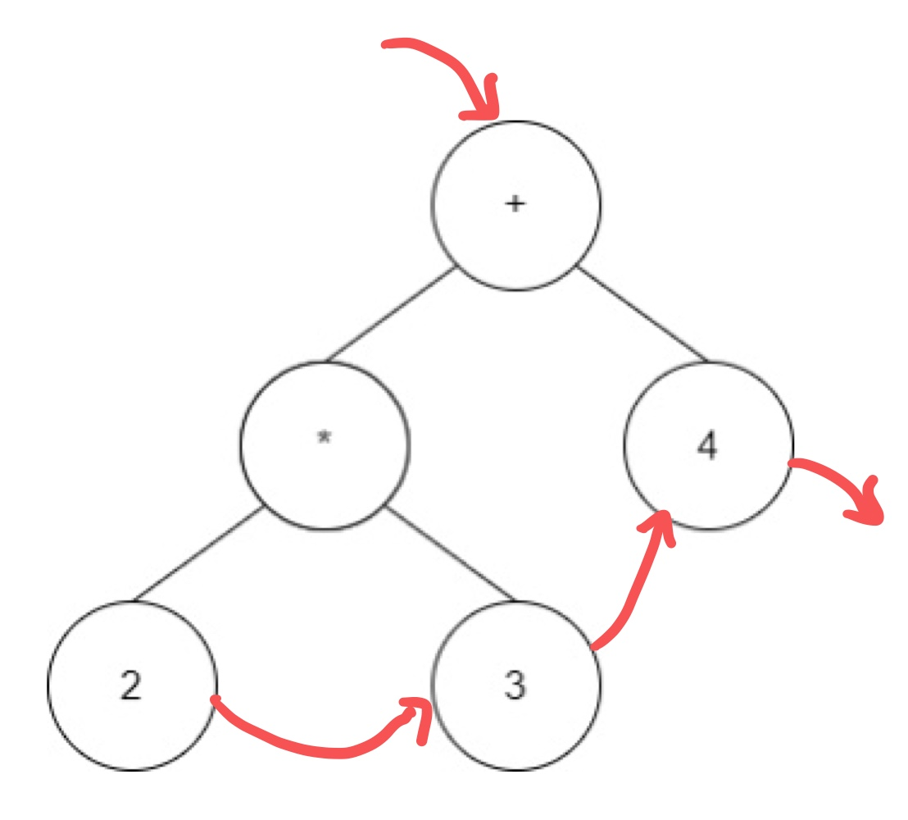
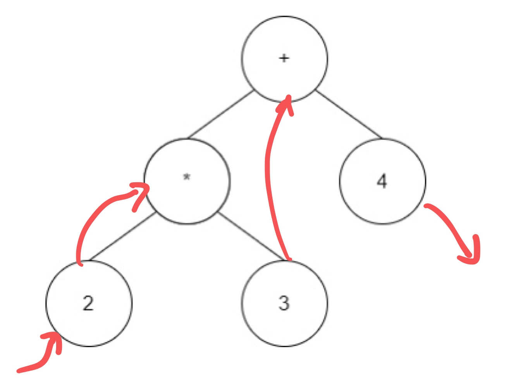
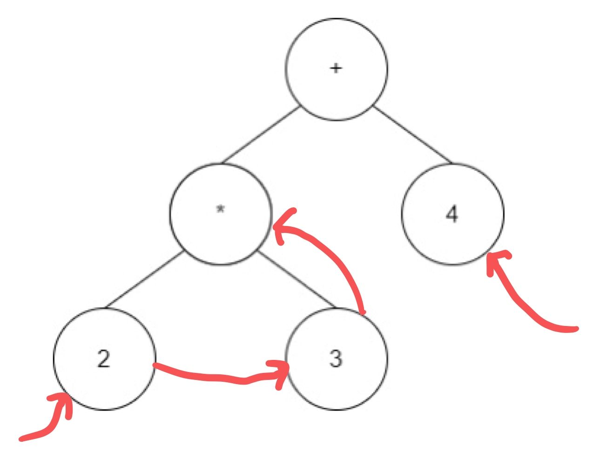

# 스레드 트리(Thread Tree)

스레드 트리란 **정해진 순회 방법(전위, 중위, 후위)에 따른 방문 순서를 유지하는 스레드 포인터를 사용한 이진 트리**이다. 스레드는 오른쪽 스레드와 왼쪽 스레드 두가지가 있다. **오른쪽 스레드는 정해진 순회 순서에 따른 그 노드의 후속 노드를 가리키고 왼쪽 스레드는 그 노드의 선행 노드를 가리킨다.** 만약 여러 순회 방법을 사용하고 싶다면 다중 스레드를 사용하여 구현하면 된다.

#### 전위 순회 스레드 트리

#### 중위 순회 스레드 트리

#### 후위 순회 스레드 트리

## 스레드 트리 구현

스레드 트리는 연결 리스트로 구현할 수 있다. 노드 구조는 기존의 트리 노드의 구조에 왼쪽, 오른쪽 스레드 포인터가 추가된 형태이다.

~~~C
struct TNode {
    int info;
    TNode left;
    TNode right;
    TNode left_thread;
    TNode right_thread;
}

//비순환 중위 순회
void inOrder(struct TNode *firstIn) {
    struct TNode *p = firstIn;
    while(p != NULL) {
        printf("%d", p->info);
        p = p->right_thread;
    }
}
~~~

위의 중위 순회 알고리즘 방식은 스레드를 위해 추가 메모리를 사용해야 한다는 단점이 있다. 또 다른 방법은 다음에 설명할 **잎 노드의 빈 포인터를 사용하는 방법**이다.

## 잎 노드의 빈 포인터를 활용한 스레드 트리

잎 노드의 왼쪽, 오른쪽 포인터는 항상 null인데 이 공간을 사용하는 것이다. 이 방법은 각 노드에 대해 포인터가 스레드로 사용 중인지 서브 트리로 사용 중인지 구분하기 위해 *tag* 필드를 사용해야 한다. 구현 방법은 예를 들어 중위 순회하고자 할 때 어떤 노드 X에 대해 오른쪽 포인터가 null이면 이 포인터를 다음으로 순회되는 노드를 가리키도록 하고, 왼쪽 포인터가 null인 경우 X의 바로 직전에 순회된 노드를 가리키도록 한다. 이렇게 구현한다면 중위 순회인 LPR이나, 역순인 RPL 순서로 순회하는 것도 가능하다.

> #### 연결 리스트로 구현한 n개의 노드를 가진 이진 트리
> * 잎 노드의 개수
>   * 왼쪽 서브 트리를 가리키는 n개의 노드, 오론쪽 서브 트리를 가리키는 n개의 노드, **총 2n개**  
> * null이 아닌 포인터의 개수
>   * 루트 노드를 제외한 각 노드의 진입 차수는 1이고, 루트를 제외한 전체노드, 즉 누군가로부터 가리켜져야할 노드의 개수가 n - 1개이기 때문에  **n - 1개**  
> * null 포인터의 개수
>   * 총 노드의 개수 - null이 아닌 포인터의 개수 => 2n - (n - 1) = **n + 1개**

### 구현

스레드 정보는 각 노드의 왼쪽 포인터 필드를 이용하는 것으로 제한하는데, 이러한 제한은 일반성을 잃지 않으면서, *tag*를 줄일 수 있게 한다. 어떤 노드의 왼쪽 포인터가 실제 왼쪽 자식을 가리키면 그대로 두고, null이면 전위 순회로 순회할 때 다음으로 순회되는 노드를 가리키도록 지정하면 전위 순회 노드들을 이을 수 있다.

~~~c
struct TFNode {
    TFNode left;
    //서브 트리 포인터를 구분하기 위한 플래그
    //왼쪽 포인터가 서브 트리에 대한 포인터면 값이 0, 오른쪽 스레드에 대한 포인터라면 1로 설정
    int threadFlag;
    int info;
    TFNode right;
}
~~~

#### 전위 순회 스레드 트리

#### 중위 순회 스레드 트리

#### 후위 순회 스레드 트리

## 스레드 트리 순회, 삽입, 삭제

### 순회

위의 후위 순회 스레드 트리 그림에서 +와 -의 왼쪽 포인터는 실제 왼쪽 자식 노드를 가리키는 포인터이다. 반면에 2와 3의 왼쪽 포인터는 다음 방문 대상인 3과 *을 가리키고 있다. 

~~~c
void preOrder(struct TFNode *root) {
    struct TFNode *p = root;
    while(p != NULL) {
        printf("%d", p->info);
        p = p->left;
    }
}
~~~

### 삽입 (`TNode` 사용)

~~~c
void insertNode(struct TNode *x, struct TNode *node) {
    node->left = NULL; //1
    node->right = x->right; //2
    node->left_thread = x; //3
    node->right_thread = x->right_thread; //4
    x->right = node; //5
    x->right_thread = node; //6
}
~~~
1. 삽입할 노드 `node`의 왼쪽 포인터를 null로 설정한다. 
2. `node`의 오른쪽 포인터가 삽입할 위치에 있는 `x`의 오른쪽 포인터 값을 가리키게 하여 `x`가 가리키던 노드를 `node`가 가리키게 설정한다.  
3. `node`의 왼쪽 스레드 포인터에 `x`의 주소를 저장하여 `node`의 이전 노드를 가리키게 한다.  
4. `x`의 오른쪽 스레드를 `node`의 오른쪽 스레드에 삽입하여 이전 노드의 다음 방문 노드를 `node`가 가리키게 한다.  
5. `x`의 오른쪽 자식 포인터를 `node`의 주소로 지정한다.
6. `x`의 오른쪽 스레드 포인터를 `node`의 주소로 지정한다.

### 삭제

내부 노드를 삭제하는 과정은 삭제한 노드의 자식 노드를 처리해야하는 어려움이 있다. 첫 번째 방법은 **삭제할 노드의 자식 노드를 모두 삭제하는 것**이다. 실제로 계층 관계에 있는 일련의 프로세스가 트리로 관리되고 있다면 최상위 프로세스를 삭제할 때 자식 프로세스들을 삭제하는 것은 일반적이다. 그러나 이 경우 스레드를 모두 수정해야하는 어려움이 생긴다. 두 번째 방법으로는 **삭제하려는 노드의 왼쪽 서브 트리나 오른쪽 서브 트리의 루트를 삭제하려는 노드의 위치로 옮기는 방법**이다. 이 방법은 스레드를 제외하고 이들 노드 중 하나가 null이 아니라면 쉽게 구현 가능하지만 모두 null이 아닌 경우에는 어떤 것을 선택할지 결정해야 한다. 마지막으로 세 번째 방법은 **잎이 아닌 노드를 삭제하지 못하게 하는 방법**이다. 만일 내부 노드를 수시로 삭제해야 하는 경우라면 스레드 방식을 포기하는 것도 방법이 될 것이다.