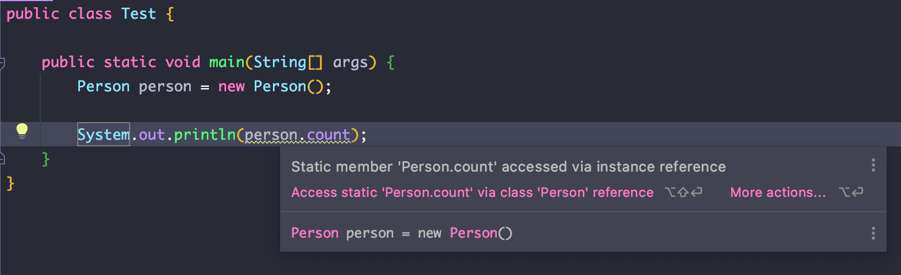
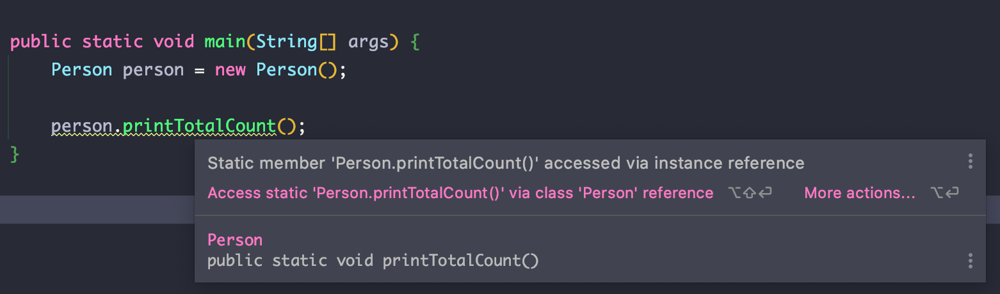
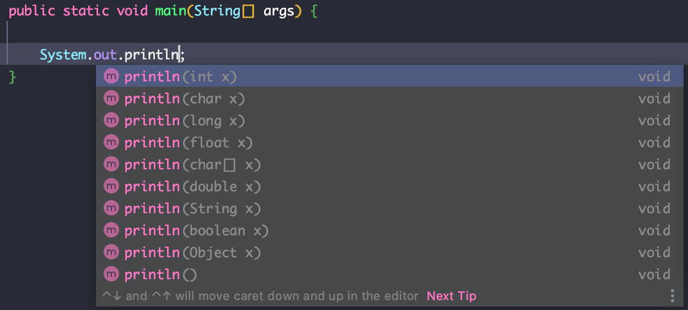

# 클래스

클래스는 객체를 만들기 위한 설계도 혹은 개념입니다. 예를 들어 사람을 프로그래밍 내에서 사람이라는 개념을 사용한다면 사람에 대한 정보를 정의해 놓는 것이 클래스이고 실체하는 것은 인스턴스입니다. 클래스에는 사람이 가지고 있는 특성과 행동을 정의하고 실체를 만들 때 사용할 수 있도록 하는 것입니다. 지금부터 사람이라는 클래스를 정의 해보면서 하나하나 알아보도록 합시다. 먼저 클래스의 몸체부터 정의해 보겠습니다.

## 클래스 몸체 정의

filename: Person.java
~~~java
public class Person {

}
~~~

`class` 라는 키워드를 선언하고 바로 뒤에 클래스의 이름을 정하면 됩니다. 기본적으로 클래스명은 [Upper camel case](https://ko.wikipedia.org/wiki/%EB%82%99%ED%83%80_%EB%8C%80%EB%AC%B8%EC%9E%90)를 사용합니다. 그리고 중괄호 내에는 클래스에 필요한 생성자나 필드, 메서드를 정의하면 됩니다.

### 접근 제어자

`class` 키워드 앞에 붙은 `public` 키워드에 대해 알아봅시다. 여기서 `public`은 접근 제어자라고 하며 총 네가지가 존재합니다. 네가지 모두 사용 가능한 범위가 다릅니다.

|키워드|범위|
|--|--|
|public|모든 패키지에서 사용 가능|
|protected|같은 패키지나 상속받은 클래스에서 사용 가능|
|default|같은 패키지에서 사용 가능, 접근 제어자를 생략하면 default가 됨|
|private|해당 클래스 내부에서만 사용 가능|

생성자, 변수, 메서드 또는 내부 클래스의 앞에 붙이게 되면 위의 표에 있는 설명에 따라 사용할 수 있는 범위가 제한 됩니다. 하지만 일반적인 클래스는 `public`과 `default`만 사용 가능하며 둘의 차이는 `public`은 파일명과 클래스명이 같을 때만 사용 가능하다는 것입니다.

filename: Person.java
~~~java
public class Person {} //ok
~~~

filename: Person.java
~~~java
public class Member {} //error
~~~

filename: Person.java
~~~java
class Member {} //ok
~~~

## 생성자

생성자는 클래스를 실체(인스턴스)화 시킬 때 사용합니다. 생성자 안에는 초기화할 것 들을 작성해주면 됩니다. 

### 생성자 선언하기

~~~java
public class Person {
    String name;

    //생성자 선언
    public Person(String name) {
        //초기화
        this.name = name;
    }
}
~~~

생성자는 생략 가능하며 생략시 컴파일러가 기본 생성자를 만들어 줍니다. 만약 생성자를 하나라도 선언해 두었다면 기본 생성자는 생성되지 않습니다.

### 생성자를 선언하지 않았을 때

~~~java
public class Person {
    String name;
}
~~~

#### 디컴파일
~~~java
public class Person {
    String name;
    Person() { //컴파일러가 생성한 생성자

    }
}
~~~

### 생성자를 선언했을 때

~~~java
public class Person {
    String name;

    Person(String name) {
        this.name = name;
    }
}
~~~

#### 디컴파일
~~~java
public class Person {
    String name;

    Person(String name) {
        this.name = name;
    }
}
~~~

### 생성자 오버로딩

오버로딩이란 같은 이름으로 여러개의 기능을 만드는 것을 말합니다. 생성자를 여러개 생성하거나 메서드를 같은 이름으로 여러개 생성해야할 때 사용하면 됩니다. 구분은 파라미터의 타입이나 개수로 합니다. 파라미터 명으로는 오버로딩을 할 수 없습니다.

~~~java
public class Person {
    String name;
    String age;
    String job;

    public Person() {

    }

    public Person(String name) {
        this.name = name;
    }

    //error! 파라미터명으로는 오버로딩 할 수 없음
    public Person(String job) {
        this.job = job;
    }

    public Person(int age) {
        this.age = age;
    }

    public Person(String name, int age) {
        this.name = name;
        this.age = age;
    }
}
~~~

### 생성자 호출하기
이제 생성자를 호출하여 인스턴스를 만들어 봅시다. 생성자를 호출하는 방법은 다음과 같습니다.

~~~java
Person person = new Person("sam"); //생성자를 호출하여 인스턴스를 반환

System.out.println(person.name); //sam;
~~~

클래스명 앞에 `new` 키워드를 붙이고 클래스명 뒤의 소괄호에는 넘겨줄 파라미터를 작성하면 됩니다. 생성자를 호출하는 즉시 heap 영역에 인스턴스가 만들어지고 `person` 변수에 인스턴스의 주솟값을 저장하게 됩니다.

## 변수

변수는 클래스 변수와 인스턴스 변수로 나뉩니다. 인스턴스 변수는 인스턴스마다 구분되는 상태나 정보를 말하고 클래스 변수는 정적 변수로 선언되어 값을 공유해서 사용할 수 있습니다. 변수명은 일반적으로 [Lower Camel case](https://ko.wikipedia.org/wiki/%EB%82%99%ED%83%80_%EB%8C%80%EB%AC%B8%EC%9E%90)를 사용합니다.

~~~java
public class Person {
    public String name;        //인스턴스 변수
    public int age;            //인스턴스 변수
    public static int count;   //클래스 변수

    public Person(String name, String age) {
        this.name = name;
        this.age = age;
    }

}
~~~

이름(`name`)과 나이(`age`)는 사람마다 구분되는 정보입니다. 물론 이름과 나이가 같은 사람이 있겠지만 기본적으로 사람은 이름으로 구분됩니다. 이 때 인스턴스 변수를 사용하면 됩니다. 반면 클래스 변수는 모든 클래스가 공유하는 값입니다. 여기서는 사람의 수(`count`)를 클래스 변수로 만들었습니다. 클래스 변수는 `static` 키워드를 변수 앞에 붙여 사용합니다.

### 인스턴스 변수 사용하기

~~~java
Person person = new Person("sam", 31); //생성자를 호출하여 파라미터로 이름과 나이를 넘김

//인스턴스 변수 호출 후 출력
System.out.println(person.name);
System.out.println(person.age);
~~~

인스턴스 변수의 경우에는 생성자를 통해 인스턴스를 만든 후 사용할 수 있습니다. 클래스에서 바로 접근이 불가능하기 때문에 인스턴스 변수라 부르는 것입니다.

~~~java
System.out.println(Person.name); //error!
~~~

### 정적 블록

그렇다면 클래스 변수는 어디서 초기화해야 할까요? 만약 초기화를 명시하지 않는 다면 기본값으로 초기화가 되겠지만 지정해서 사용하고 싶을 때도 있을 것입니다. 이 때 정적 블록을 사용하여 초기화하면 됩니다.

~~~java
class Person {
    public static int count;

    static {
        count = 10;
    }
}
~~~

정적 블록은 `static` 이라는 키워드 뒤에 블록을 선언해서 그 안에 초기화할 것들을 명시해 주면 됩니다. 정적 블록이기 때문에 당연히 인스턴스 변수나 메서드는 호출할 수 없습니다. 이 블록은 클래스가 로딩될 때 딱 한 번만 호출됩니다.

### 인스턴스 블록

정적 블록을 알아봤으니 인스턴스 블록도 알아봅시다. 인스턴스 블록은 말 그대로 인스턴스에 관련된 변수를 초기화 하거나 메서드를 실행할 때 사용합니다.

~~~java
class Person {
    public String name;

    {
        name = "sam";
    }
}
~~~

### 블록 호출 순서

정적 블록, 인스턴스 블록, 생성자의 호출 순서에 대해 알아봅시다. 당연히 정적 블록은 클래스가 로딩될 때 호출 되므로 가장 먼저 호출 될 것입니다. 그렇다면 인스턴스 블록과 생성자 중 어느 것이 더 빨리 호출 될까요? 한 번 실행해 봅시다.

~~~java
class Person {
    public String name;
    public static int count;

    static {
        count = 10;
        System.out.println("정적 블록");
    }

    {
        this.name = "sam";
        System.out.println("인스턴스 블록");
    }

    public Person() {
        count++;
        System.out.println("생성자");
    }

}
~~~
#### 실행 결과
~~~
정적 블록
인스턴스 블록
생성자
~~~

### 클래스 변수 사용하기

클래스 변수는 정적 변수이기 때문에 클래스로 바로 접근할 수 있고 인스턴스로도 접근 할 수 있습니다.

~~~java
System.out.println(Person.count); //0

Person person = new Person("sam", 31);
System.out.println(person.count); //0
~~~

하지만 인스턴스로의 접근은 하지 않는 것이 좋습니다. 의미적으로도 클래스 변수는 클래스에 종속되어 있는 것이지 인스턴스에 종속되어 있는 것이 아니기 때문입니다. 따라서 인스턴스로 접근을 하려고 하면 컴파일러는 경고를 띄울 것입니다.

## 메서드

메서드는 객체의 행동을 정의합니다. 사람은 말할 수 있고, 걸을 수 있을 것입니다. 이러한 행위 자체를 메서드로 정의하여 사용하면 됩니다. 메서드도 변수처럼 클래스 메서드와 인스턴스 메서드를 사용할 수 있습니다. 메서드명은 변수명과 마찬가지로 Lower Camel case를 사용하며, 기본적인 메서드의 형식은 다음과 같습니다.

~~~
<접근제어자> <반환 타입> 메서드명(파라미터) {
    내용
    return 반환값 //없을 시 생략 가능
}
~~~

#### 사용 예

~~~java
public String hello(String name) {
    return name + " hello";
}
~~~

여기서 반환 값은 String으로 지정되어 있는데 `return` 키워드를 붙인 후 그 뒤에 값을 명시해주면 됩니다. 메서드를 실행하다가 `return`을 만나게 되면 즉시 해당 메서드를 빠져나오게 되기 때문에 `return` 뒤에는 코드를 작성할 수 없습니다.

~~~java
public String method() {
    System.out.println(1);
    System.out.println(2);
    System.out.println(3);
    return "hello";
    System.out.println(4); //unreachable statement
    System.out.println(5);
}
~~~

위의 코드를 올바르게 작동시키려면 `return`을 마지막으로 옮기거나 분기문으로 감싸고 마지막 라인에 `return`을 사용하면 됩니다.

~~~java
public String method() {
    System.out.println(1);
    System.out.println(2);
    System.out.println(3);
    if (name.equals("sam")) {
        return "bye";
    }
    System.out.println(4); //unreachable statement
    System.out.println(5);
    return "hello";
}
~~~

만약 메서드가 값을 반환할 필요가 없다면 반환 타입에 `void`를 명시해주면 됩니다.

~~~java
public void sayHello() {
    Systme.out.println("hello");
}
~~~

### 인스턴스 메서드

인스턴스 메서드는 인스턴스 변수와 마찬가지로 인스턴스가 생성된 후 사용할 수 있는 메서드 입니다. 메서드 내부에서 인스턴스 변수와 클래스 변수 모두 사용이 가능합니다.

~~~java
class Person {
    public String name;
    public static int age;

    public Person(String name) {
        this.name = name;
        age++;
    }

    public void sayHello() {
        System.out.println(this.name + "님 현재 인원은" + age + "명 입니다.");
    }
}
~~~

#### 인스턴스 메서드 호출 방법

인스턴스 메서드는 인스턴스를 만든 후 호출하면 됩니다.

~~~java
Person person = new Person("sam");

person.sayHello(); //sam님 현재 인원은 1명입니다.
~~~

### 클래스 메서드

클래스 메서드는 인스턴스가 아닌 클래스에 종속되는 메서드입니다. 클래스 변수와 마찬가지로 인스턴스 메서드 처럼 선언한 후 `static` 키워드를 붙여 사용하며 클래스 메서드 내부에서는 클래스 변수만 사용 가능합니다.

~~~java
class Person {
    //..

    public static void printTotalCount() {
        System.out.println(count);
        // System.out.println(this.name); //error
    }
}
~~~

#### 클래스 메서드 호출 방법

클래스 메서드는 클래스 변수와 마찬가지로 클래스로 접근하여 호출하거나, 인스턴스로 접근하여 호출 할 수 있습니다. 

~~~java
Person.printTotalCount(); //1

Person person = new Person("sam");
person.printTotalCount(); //1
~~~

하지만 클래스 메서드는 인스턴스가 아닌 클래스에 종속되는 것이기 때문에 인스턴스로 호출하게 되면 클래스 변수와 마찬가지로 경고가 발생합니다.

### 메서드 오버로딩

메서드 오버로딩은 생성자 오버로딩과 마찬가지로 같은 이름으로 다른 메서드를 사용하고 싶을 때 사용합니다. 파라미터의 타입이나 파라미터의 순서로 구분 가능하며 반환 값이 다른 것은 해당되지 않습니다. 대표적으로 `System.out.print` 함수가 있습니다.

#### 메서드 오버로딩 하는 법

~~~java
public class Calculator {
    public static int sum(int a) {
        return a + 1;
    }

    public static int sum(int a, int b) {
        return a + b;
    }

    public static int sum(int a, int b, int c) {
        return a + b + c;
    }

    public static double sum(int a, double b) {
        return a + b;
    }

    public static double sum(double a, int b) {
        return a + b;
    }

    //error! 파라미터명은 오버로딩 조건에 포함되지 않는다.
    public static int sum(double c, int d) {
        return (int) c + d;
    }

    //error! 반환 값은 오버로딩 조건에 포함되지 않는다.
    public static int sum(double a, int b) {
        return (int) a + b;
    }
}
~~~

## this

위의 예제들에서 `this`를 많이 보았을 것입니다. `this`는 두 가지 기능을 하는데 하나씩 알아보도록 하겠습니다.

### 자기 자신의 인스턴스를 가리키는 지시자

`this`는 자기 자신의 인스턴스를 가리킬 때 사용합니다. `this` 뒤에 접근 지시자를 붙여 변수나 메서드를 호출할 수 있습니다. 생성자나 메서드의 파라미터와 인스턴스 필드의 변수명이 같을 때 구분하는 용도로도 사용이 가능합니다. 인스턴스를 가리키기 때문에 클래스 변수나 클래스 메서드는 가리킬 수 없습니다.

### 생성자 오버로딩시 다른 생성자 호출

생성자 오버로딩을 할 때 다른 생성자를 내부에서 호출해야 한다면 `this`를 사용하여 호출하면 됩니다. 이 경우 해당 생성자에서 직접 생성하는 것이 아니라 `this`로 호출한 생성자로 생성을 위임을 하는 것입니다.

~~~java
class Person {
    public String name;
    public int age;
    public static int count;

    public Person() {
        this("sam", 0); //해당 파라미터를 가지는 생성자 호출
    }

    public Person(String name) {
        this(name, 0); //해당 파라미터를 가지는 생성자 호출
    }

    public Person(String name, int age) {
        //변수명이 같지만 앞에 this를 붙임으로써 인스턴스 변수인지 파라미터인지 구분이 가능
        this.name = name;
        this.age = age;
        
        //클래스 변수이기 때문에 this 사용 불가
        // this.count = 10;
    }

    public void instanceMethod() {
        System.out.println("Instance method");
    }

    public static void classMethod() {
        System.out.println("Class Method");
    }

    public void method() {
        this.instanceMethod(); //자기 자신의 인스턴스 메서드를 호출함

        //호출 불가
        // classMethod();

    }
}
~~~

## 만약 런타임시 클래스의 정보를 알고 싶다면?

만약 해당 클래스의 정보를 런타임시 알고 싶을 때는 어떻게 할까요? 일반적인 애플리케이션을 개발하는 개발자라면 사용할 일이 거의 없겠지만 `Spring`이나 `Jackson` 같은 프레임워크, 라이브러리를 개발하는 개발자라면 사용할 일이 많을 것입니다. 이 때 사용하는 것이 Reflection API 입니다. Reflection API를 사용하면 클래스의 정보(생성자, 필드, 메서드 등)을 확인할 수 있으며, 그 클래스 멤버들을 호출하여 상황에 따라 인스턴스를 유동적으로 생성할 수도 있습니다. 자세한 내용은 [이 곳](https://pocada.medium.com/java-reflection-api-1-61c3fc957e6d)에 정리해 놓았으니 참고바랍니다.

